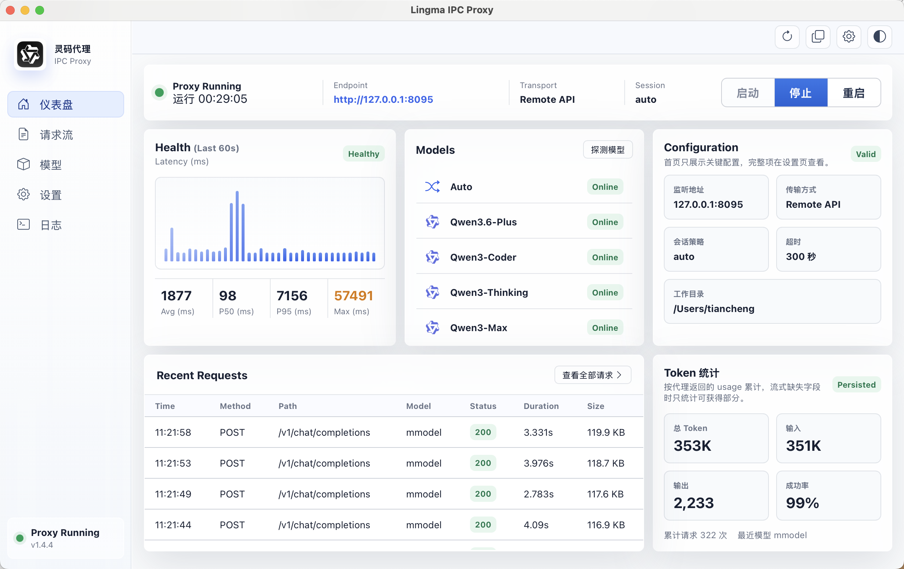
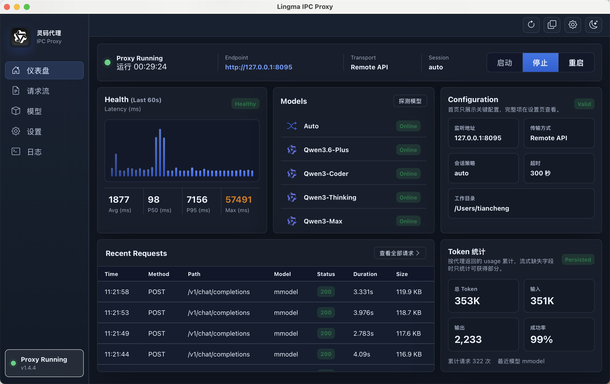
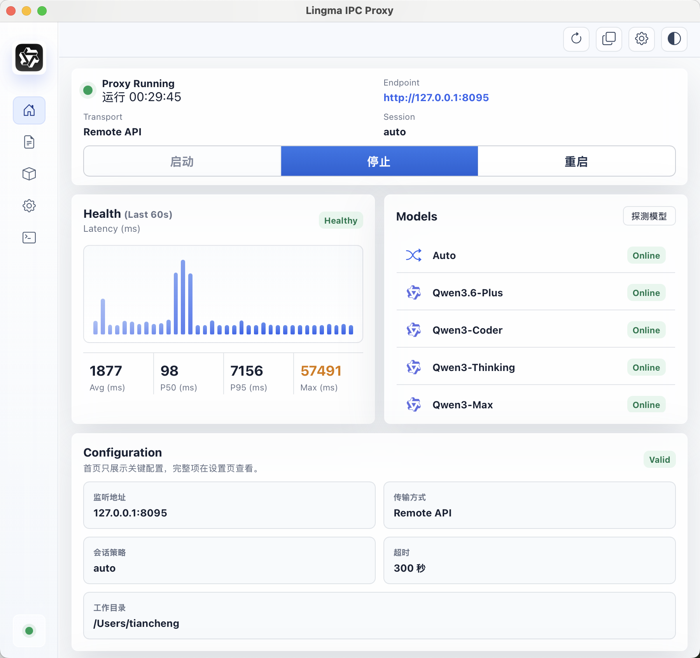
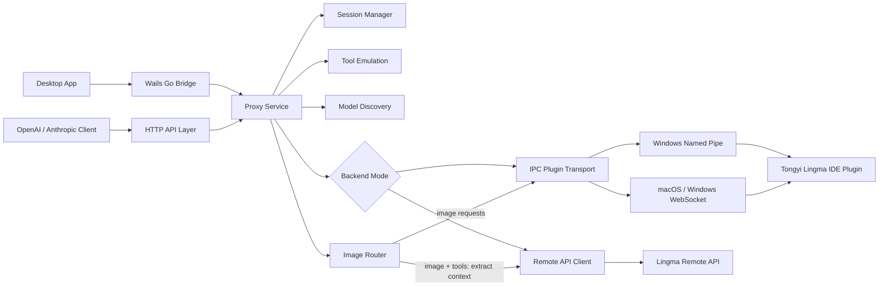

# Lingma Proxy

[English](./README.md) | [简体中文](./README.zh-CN.md)

Lingma Proxy exposes Tongyi Lingma as standard **OpenAI-compatible** and **Anthropic-compatible** HTTP APIs. It can use either the recommended Remote API backend or the local IDE plugin IPC channel, and ships as both a CLI proxy service and a cross-platform desktop app for macOS and Windows.

The project is designed for tools such as Claude Code, Cline, Continue, OpenCode, custom agents, and any client that can talk to OpenAI or Anthropic style APIs.

The proxy now supports two backend modes:

- **Remote API mode (default, recommended)**: imports the local Lingma login cache or an explicit credential file and calls Lingma remote APIs directly. This behaves closest to a normal hosted API, avoids IDE/plugin session and environment limits, and is currently the best mode for Claude Code / Hermes style agents.
- **IPC plugin mode**: connects to the local Lingma IDE plugin over WebSocket / Named Pipe. This keeps behavior closest to the IDE plugin, but it can inherit IDE session lifetime, local plugin state, and environment constraints, so it is mainly a compatibility fallback.

## Current Version

The current desktop line is `v1.4.10`.

See [CHANGELOG.md](./CHANGELOG.md) for release history.

Release builds are produced by GitHub Actions for:

| Asset | Platform | Purpose |
| --- | --- | --- |
| `lingma-proxy_<tag>_darwin_arm64.tar.gz` | macOS | CLI proxy |
| `lingma-proxy_<tag>_windows_amd64.zip` | Windows | CLI proxy |
| `lingma-proxy-desktop_<tag>_darwin_arm64.dmg` | macOS Apple Silicon | Drag-to-install desktop app |
| `lingma-proxy-desktop_<tag>_darwin_arm64.zip` | macOS Apple Silicon | Raw `.app` archive |
| `lingma-proxy-desktop_<tag>_windows_amd64.zip` | Windows | Desktop app |
| `lingma-proxy_<tag>_sha256.txt` | all | Checksums |

### Which Package Should I Download?

| Your system | Recommended asset | Notes |
| --- | --- | --- |
| macOS on Apple Silicon (M1/M2/M3/M4) | `lingma-proxy-desktop_<tag>_darwin_arm64.dmg` | Open the DMG and drag `Lingma Proxy.app` to `Applications`. |
| macOS on Apple Silicon, portable archive | `lingma-proxy-desktop_<tag>_darwin_arm64.zip` | Same app, but packaged as a zip instead of a drag-to-install DMG. |
| Windows x64 / x86_64 / AMD64 | `lingma-proxy-desktop_<tag>_windows_amd64.zip` | This is the correct package for normal 64-bit Windows PCs, including Intel and AMD CPUs. |
| macOS CLI only | `lingma-proxy_<tag>_darwin_arm64.tar.gz` | Terminal-only proxy binary. |
| Windows CLI only | `lingma-proxy_<tag>_windows_amd64.zip` | Terminal-only proxy binary for 64-bit Windows. |

There is currently no separate `windows_arm64` package. On a normal x64 Windows machine, choose `windows_amd64`.

## Desktop App

The desktop app wraps the proxy with a native-feeling control panel:

- Start, stop, and restart the proxy.
- Inspect health, latency, recent requests, models, settings, and logs.
- View full request and response bodies with internal scrolling and hidden scrollbars.
- Copy endpoint URLs, model IDs, request logs, and response logs with visible feedback.
- Detect Lingma IPC paths automatically on macOS and Windows, with manual fallback settings.
- Follow system theme automatically, or switch light/dark mode manually.
- Keep the proxy running when the window is closed; quit explicitly from the app/menu.

### Screenshots

Light mode:



Dark mode:



Narrow window layout:



## Supported APIs

| API | Endpoint | Support |
| --- | --- | --- |
| Health | `GET /`, `HEAD /`, `GET /health`, `HEAD /health` | supported |
| Models | `GET /v1/models` | supported |
| Capability Discovery | `GET /capabilities`, `GET /v1/capabilities` | supported |
| Debug Requests | `GET /debug/requests`, `GET /debug/logs` | recent HTTP request history |
| Debug Aliases | `GET /api/requests`, `GET /api/logs` | aliases for request/log inspection |
| LM Studio / Ollama Discovery | `GET /api/v1/models`, `GET /api/tags`, `GET /props` | supported |
| OpenAI Chat Completions | `POST /v1/chat/completions` | streaming and non-streaming |
| OpenAI Chat Alias | `POST /api/v1/chat/completions` | supported |
| Anthropic Messages | `POST /v1/messages` | streaming and non-streaming |

## What This Fork Adds

Compared with the original protocol proof of concept, this repository focuses on making the proxy usable as a complete local product:

- **Function Calling / Tools** for both OpenAI and Anthropic clients.
- **Tool result continuation** for multi-step agent loops.
- **Tool stability hardening** with proxy-side routing hints, core tool examples, missed-tool retry, and common alias mapping such as `Bash` to `terminal` and `Read` to `read_file`.
- **Anthropic streaming tool-call hardening** so streaming clients such as Claude Code receive final `tool_use` events instead of premature refusal text when tools are present.
- **Image input** for OpenAI `image_url` and Anthropic image blocks.
- **Local and remote image normalization** for data URLs, HTTP URLs, `file://` URLs, and absolute local paths, with automatic JPEG downscaling for large images.
- **Remote-mode image fallback** so image requests use the proven Lingma IPC image pipeline; image + tool requests extract image context through IPC and then return to Remote API native tool calling.
- **Request log image redaction** so large base64 payloads are visible as image markers instead of breaking the desktop log view.
- **More request parameter compatibility** so stricter clients can connect without custom patches.
- **Full request and response recording** in the desktop app for debugging 400/500 errors.
- **macOS and Windows desktop app** with start/stop/restart, settings, logs, model discovery, themes, and window lifecycle handling.
- **Cross-platform release packaging** for CLI and desktop builds.

### OpenAI Compatibility

The proxy accepts common OpenAI request fields:

- `model`, `messages`, `stream`
- `temperature`, `top_p`, `stop`
- `max_tokens`, `max_completion_tokens`
- `presence_penalty`, `frequency_penalty`
- `tools`, `tool_choice`, `parallel_tool_calls`
- `response_format`, `seed`, `user`, `reasoning_effort`
- image input through `image_url` data URLs, HTTP URLs, `file://` URLs, and absolute local paths

### Anthropic Compatibility

The proxy accepts common Anthropic request fields:

- `model`, `system`, `messages`, `stream`
- `temperature`, `top_p`, `top_k`, `stop_sequences`
- `max_tokens`, `metadata`
- `tools`, `tool_choice`
- image blocks through base64 sources
- tool result continuation blocks

## Architecture



### Module Layout

| Path | Responsibility |
| --- | --- |
| `cmd/lingma-ipc-proxy` | CLI entrypoint, config loading, signal handling |
| `internal/httpapi` | OpenAI/Anthropic HTTP routes, streaming SSE responses, request recording |
| `internal/service` | request orchestration, sessions, model discovery, proxy lifecycle |
| `internal/lingmaipc` | Lingma JSON-RPC transport over Named Pipe and WebSocket |
| `internal/remote` | remote Lingma login-cache import, signing, model list, and SSE parsing |
| `internal/toolemulation` | tool definition injection, action block parsing, tool result projection |
| `desktop` | Wails desktop shell, native window commands, proxy control bridge |
| `desktop/frontend` | Vue UI for dashboard, requests, models, settings, and logs |
| `.github/workflows/release.yml` | CI release pipeline for macOS and Windows CLI/Desktop packages |

## Transport Detection

| Platform | Default transport | Detection |
| --- | --- | --- |
| macOS | WebSocket | reads Lingma `SharedClientCache` files under user application support paths and `~/.lingma` fallbacks |
| Windows | Named Pipe / WebSocket | scans Lingma named pipes plus `%APPDATA%`, `%LOCALAPPDATA%`, `%ProgramData%`, and `%USERPROFILE%\.lingma` shared cache hints |
| Linux | WebSocket | reads `~/.lingma` / XDG hints when present; manual `--ws-url` is still recommended |

If auto detection fails, set the path manually in the desktop Settings page or pass CLI flags:

```bash
lingma-proxy --transport websocket --ws-url ws://127.0.0.1:36510 --port 8095
lingma-proxy --transport pipe --pipe '\\.\pipe\lingma-ipc'
```

## Backend Modes

### Remote API Mode (Default, Recommended)

Remote mode calls Lingma's remote API directly:

```bash
lingma-proxy --backend remote --port 8095
```

By default it reads the local Lingma login cache in read-only mode:

```text
~/.lingma/cache/user
~/.lingma/cache/id
~/.lingma/logs/lingma.log
%APPDATA%\Lingma\cache\user
%LOCALAPPDATA%\Lingma\cache\user
XDG config/state Lingma cache paths when present
```

You can also pass an explicit credential file:

```bash
lingma-proxy \
  --backend remote \
  --remote-base-url https://lingma.alibabacloud.com \
  --remote-auth-file ~/.config/lingma-proxy/credentials.json
```

Credential file format:

```json
{
  "source": "manual",
  "token_expire_time": "1777520000000",
  "auth": {
    "cosy_key": "xxx",
    "encrypt_user_info": "xxx",
    "user_id": "123",
    "machine_id": "xxxxxxxxxxxxxxxx"
  }
}
```

Notes:

- Remote API mode is the recommended default for day-to-day agent usage. It bypasses the IDE/plugin IPC runtime, so it is less affected by plugin session state, IDE working directory, or local extension environment limitations.
- Remote mode does not write or migrate login state. It only reads the local Lingma cache or the credential file you provide.
- If your Lingma plugin uses a dedicated domain, remote mode first uses `--remote-base-url`, `LINGMA_REMOTE_BASE_URL`, or the JSON config field. If those are empty, it scans Lingma's local logs on macOS, Windows, and Linux for endpoint hints such as `endpoint config:` and marketplace service URLs.
- The desktop Settings page shows the resolved remote domain and detection source without exposing tokens.
- `/v1/models` in remote mode returns remote API model keys, which may not match the IPC plugin display IDs such as `MiniMax-M2.7` or `Kimi-K2.6`.
- Image requests in remote mode are routed through the IPC image pipeline because the direct remote chat endpoint ignores local `file://` and data URL image payloads. If a request also contains tools, Lingma Proxy first extracts image context through IPC and then sends the tool-capable turn through Remote API native tool calling.
- Local validation passed `/health`, `/v1/models`, OpenAI streaming/non-streaming chat, and Claude Code Anthropic + Bash tool use. Claude Code full tool runs are much slower than simple OpenAI requests because the client sends a large context and performs a second tool-result turn.
- This mode is inspired by the remote API and credential-signing research in [ZipperCode/lingma2api](https://github.com/ZipperCode/lingma2api), integrated here as a switchable backend under the existing OpenAI / Anthropic / desktop app architecture.

### IPC Plugin Mode

IPC mode talks to the local Lingma IDE plugin:

```bash
lingma-proxy --backend ipc --transport auto --port 8095
```

Use this when VS Code / the Lingma plugin is already running, when you want plugin session behavior, or when you want the exact model list exposed by the local plugin. Compared with Remote API mode, IPC mode is more coupled to the IDE/plugin process and can be affected by that process's session, current project, and local environment.

## Quick Start

### Desktop App

1. Install VS Code and the Tongyi Lingma extension.
2. Log in to Tongyi Lingma and verify the Lingma panel can chat normally.
3. Download the desktop asset from [Releases](https://github.com/Lutiancheng1/lingma-proxy/releases).
4. Start `Lingma Proxy`.
5. Click `探测模型` after the proxy is running.
6. Configure clients to use `http://127.0.0.1:8095`.

### CLI

```bash
git clone https://github.com/Lutiancheng1/lingma-proxy.git
cd lingma-proxy
go build -o ./dist/lingma-proxy ./cmd/lingma-ipc-proxy
./dist/lingma-proxy --host 127.0.0.1 --port 8095 --session-mode auto
```

Windows:

```powershell
.\scripts\build.ps1
.\dist\lingma-proxy.exe --host 127.0.0.1 --port 8095 --session-mode auto
```

## Client Configuration

### Claude Code

```bash
export ANTHROPIC_BASE_URL="http://127.0.0.1:8095"
export ANTHROPIC_API_KEY="any"
```

Then select a model in Claude Code:

```text
/model kmodel
```

### Cline

- Provider: `OpenAI Compatible`
- Base URL: `http://127.0.0.1:8095/v1`
- API Key: `any`
- Model ID: `kmodel`

### Continue

```json
{
  "models": [
    {
      "title": "Lingma Proxy",
      "provider": "openai",
      "model": "kmodel",
      "apiKey": "any",
      "apiBase": "http://127.0.0.1:8095/v1"
    }
  ]
}
```

## Models

The proxy reports the models exposed by the Lingma plugin. The desktop app does not force a global model switch; the calling client should specify the `model` field. Clicking a model in the desktop app copies its model ID.

Observed model IDs include:

- `Auto`
- `Kimi-K2.6`
- `MiniMax-M2.7`
- `Qwen3-Coder`
- `Qwen3-Max`
- `Qwen3-Thinking`
- `Qwen3.6-Plus`

### Model Metadata and Recommendation

The proxy only reports models actually exposed by your Lingma plugin. The table below combines official model information where available with local proxy testing. If Lingma exposes a model name without public model-card metadata, the README marks it as observed rather than inventing a context length.

| Model | Best use | Context / capability basis |
| --- | --- | --- |
| `Kimi-K2.6` (`kmodel` in remote mode) | Default recommendation for remote API mode and third-party agents | Kimi's [official API docs](https://platform.kimi.ai/docs/guide/kimi-k2-6-quickstart) describe native text/image/video input, a 256K context window, and multi-step tool invocation support. Local Claude Code testing showed cleaner native tool execution in remote mode. |
| `MiniMax-M2.7` (`mmodel` in remote mode) | Fast fallback | NVIDIA's [MiniMax M2.7 model card](https://developer.nvidia.com/blog/minimax-m2-7-advances-scalable-agentic-workflows-on-nvidia-platforms-for-complex-ai-applications/) describes a language MoE model with 200K input context and agentic use cases; local proxy testing passed read/search/terminal/web/patch/vision smoke tests and was fast in previous runs. |
| `Qwen3-Coder` | Code-specialized fallback | Qwen's [official blog](https://qwenlm.github.io/blog/qwen3-coder/) describes 256K native context, up to 1M with extrapolation, and agentic coding/tool protocols. |
| `Qwen3.6-Plus` | General/vision fallback | Exposed by Lingma and passed local smoke tests, but this repository does not have an official Lingma-specific context-length source for it. |
| `Qwen3-Max` | Fast general/vision model | Exposed by Lingma and strong in simple tests, but less stable on forced edit/read tool calls in this proxy. |

Default model when the client omits `model`: `kmodel` (`Kimi-K2.6` in the remote model list).

Remote mode enables fallback by default. The default proxy request timeout is `0`, which means Lingma Proxy does not set its own per-request deadline and is suitable for long agent workflows. If you set `"timeout"` to a positive number of seconds, timeout errors can also trigger fallback. Upstream 5xx/429 or network interruption can trigger fallback regardless of the timeout setting, but the proxy only switches models if no streaming bytes have been sent to the client yet. Fallback candidates are filtered against the actual `/v1/models` response, so unavailable models are skipped. Default order:

`Kimi-K2.6 -> MiniMax-M2.7 -> Qwen3-Coder -> Qwen3.6-Plus -> Qwen3-Max -> Qwen3-Thinking`

## Configuration

Default config file:

```text
./lingma-proxy.json
./lingma-ipc-proxy.json  # legacy fallback
```

Example:

```json
{
  "host": "127.0.0.1",
  "port": 8095,
  "backend": "ipc",
  "transport": "auto",
  "remote_base_url": "",
  "remote_auth_file": "",
  "remote_version": "",
  "mode": "agent",
  "shell_type": "zsh",
  "session_mode": "auto",
  "timeout": 0,
  "remote_fallback_enabled": true,
  "remote_fallback_models": [
    "kmodel",
    "mmodel",
    "dashscope_qwen3_coder",
    "dashscope_qmodel",
    "dashscope_qwen_max_latest",
    "dashscope_qwen_plus_20250428_thinking"
  ],
  "cwd": "/Users/you/project",
  "current_file_path": ""
}
```

Priority order:

1. built-in defaults
2. JSON config file
3. environment variables
4. command-line flags
5. desktop Settings page updates

## Concurrency

Older builds rejected concurrent chat requests with a `rate_limit_error` saying the proxy handled one request at a time. Current builds use a small execution pool instead:

- default max concurrent chat requests: `4`
- override with `LINGMA_PROXY_MAX_CONCURRENT`
- allowed range: `1` to `16`
- `session_mode=auto` uses fresh Lingma sessions so parallel editor requests do not share one sticky session

Example:

```bash
LINGMA_PROXY_MAX_CONCURRENT=8 lingma-proxy --port 8095
```

## Function Calling / Tool Calling

Lingma does not expose a native public OpenAI/Anthropic tool-call protocol, so this proxy emulates tool calling:

1. Normalize OpenAI or Anthropic tool definitions.
2. Inject tool contracts into the Lingma prompt.
3. Parse model action blocks from the response.
4. Convert parsed actions back into OpenAI `tool_calls` or Anthropic `tool_use`.
5. Feed tool results back into Lingma for continuation.

Current proxy hardening includes:

- a generated tool routing table based on the client's actual tool names
- dedicated examples for `read_file`, `search_files`, `terminal`, and `web_search`
- automatic retry when the model says it cannot access files, terminal, or web despite tools being present
- common tool alias normalization such as `Bash` -> `terminal`, `Read` -> `read_file`, `Grep` -> `search_files`, and `Edit` -> `patch`
- Anthropic `stream=true` requests with tools are resolved internally before streaming the final `tool_use` blocks, which avoids sending premature "please run this command yourself" text to clients such as Claude Code.

In local smoke tests after this hardening, `MiniMax-M2.7`, `Kimi-K2.6`, `Qwen3.6-Plus`, and `Qwen3-Coder` all completed read/search/terminal/web/patch/vision checks. Remote API mode with `kmodel` is now the default because it avoids Lingma IDE IPC session limits and behaved better with Claude Code and Hermes-style local tools.

## Request And Log Inspection

The desktop app keeps a visual request stream, and the HTTP server also exposes a small read-only debug history for CLI troubleshooting.

Useful endpoints:

```bash
curl http://127.0.0.1:8095/health
curl -I http://127.0.0.1:8095/
curl 'http://127.0.0.1:8095/debug/requests?limit=20'
curl 'http://127.0.0.1:8095/debug/logs?limit=20'
```

`/debug/requests` and `/debug/logs` return the newest records first. Each record includes:

- request time
- HTTP method and path
- status code
- duration in milliseconds
- sanitized request body
- sanitized response body

The server keeps the most recent 200 HTTP records in memory. Image payloads and large base64 strings are redacted before recording, and very large bodies are truncated to keep the desktop UI responsive.

These debug endpoints are intended for local development and client-adapter troubleshooting. They should only be exposed on trusted localhost networks.

## Local Desktop Build

Install Wails:

```bash
go install github.com/wailsapp/wails/v2/cmd/wails@v2.12.0
```

Build macOS:

```bash
npm ci --prefix desktop/frontend
cd desktop
wails build -platform darwin/arm64 -clean
```

Build Windows on Windows:

```powershell
npm ci --prefix desktop/frontend
cd desktop
wails build -platform windows/amd64 -clean
```

The desktop bundle name is always `Lingma Proxy`.

## Release Plan

The release workflow is triggered by:

- pushing a tag such as `v1.4.0`
- manually running the `Release` workflow with a tag input

Planned improvements:

- macOS signing and notarization
- Windows installer packaging
- configurable log retention
- request export/import
- richer model metadata display
- optional Linux desktop packaging after the Lingma transport story is stable

## Acknowledgements

The **IPC plugin mode** is based on the protocol insight and initial discovery work from [coolxll/lingma-ipc-proxy](https://github.com/coolxll/lingma-ipc-proxy). That project first demonstrated that Lingma's private local IPC protocol can be bridged to standard HTTP API endpoints. Lingma Proxy keeps that IPC path as a compatibility backend and extends it with broader OpenAI/Anthropic compatibility, tool emulation, image handling, desktop app support, request/log inspection, cross-platform packaging, and release automation. The default **Remote API mode** is a separate backend that calls Lingma remote APIs directly and is documented independently above.
