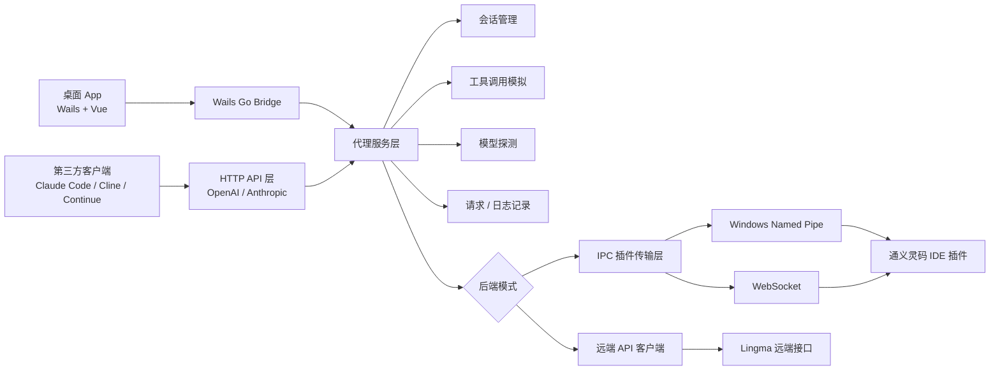

# Lingma Proxy

[English](./README.md) | [简体中文](./README.zh-CN.md)

**Lingma Proxy** 是一个通义灵码 API 适配层。它可以通过默认推荐的远端 API 模式直接调用 Lingma 远端接口，也可以把 Lingma 插件的本地私有 IPC / WebSocket 能力转换成标准 **OpenAI 兼容接口** 和 **Anthropic 兼容接口**，让 Claude Code、Cline、Continue、OpenCode、自研 Agent 等第三方客户端可以直接调用 Lingma 后端模型。

项目同时提供两种使用方式：

- **CLI 代理服务**：适合后台常驻、脚本化和服务器式运行。
- **跨平台桌面 App**：适合日常可视化管理，支持 macOS 和 Windows。

代理后端支持两种模式：

- **远端 API 模式（默认，推荐）**：读取 Lingma 本地登录缓存或显式凭据，直接调用 Lingma 远端接口。它更接近普通托管 API，不依赖 IDE 插件窗口、IPC 会话和插件执行环境；目前更推荐给 Claude Code / Hermes 这类本地 Agent。
- **IPC 插件模式**：连接本机 Lingma IDE 插件的 WebSocket / Named Pipe。它更接近 IDE 插件上下文，但会继承 IDE 会话生命周期、插件本地状态和环境限制，主要作为兼容性兜底。

## 当前版本

当前桌面端版本线：`v1.4.8`

版本更新记录见 [CHANGELOG.md](./CHANGELOG.md)。

GitHub Actions 会在 Release 中产出：

| 产物 | 平台 | 用途 |
| --- | --- | --- |
| `lingma-proxy_<tag>_darwin_arm64.tar.gz` | macOS | CLI 代理 |
| `lingma-proxy_<tag>_windows_amd64.zip` | Windows | CLI 代理 |
| `lingma-proxy-desktop_<tag>_darwin_arm64.dmg` | Apple Silicon Mac | 拖拽安装桌面 App |
| `lingma-proxy-desktop_<tag>_darwin_arm64.zip` | Apple Silicon Mac | `.app` 压缩包 |
| `lingma-proxy-desktop_<tag>_windows_amd64.zip` | Windows | 桌面 App |
| `lingma-proxy_<tag>_sha256.txt` | 全平台 | 校验文件 |

### 应该下载哪个包？

| 你的系统 | 推荐下载 | 说明 |
| --- | --- | --- |
| Apple Silicon Mac（M1/M2/M3/M4） | `lingma-proxy-desktop_<tag>_darwin_arm64.dmg` | 打开 DMG 后把 `Lingma Proxy.app` 拖到 `Applications`。 |
| Apple Silicon Mac，想要压缩包 | `lingma-proxy-desktop_<tag>_darwin_arm64.zip` | 和 DMG 是同一个 App，只是 zip 形式。 |
| Windows x64 / x86_64 / AMD64 | `lingma-proxy-desktop_<tag>_windows_amd64.zip` | 普通 64 位 Windows 电脑都选这个，包括 Intel 和 AMD CPU。 |
| 只想在 macOS 终端跑 CLI | `lingma-proxy_<tag>_darwin_arm64.tar.gz` | 只有命令行代理，没有桌面界面。 |
| 只想在 Windows 终端跑 CLI | `lingma-proxy_<tag>_windows_amd64.zip` | 只有命令行代理，没有桌面界面。 |

目前没有单独的 `windows_arm64` 包。常见 x64 Windows 机器请选择 `windows_amd64`。

## 功能概览

| 能力 | 状态 |
| --- | --- |
| OpenAI Chat Completions | 支持流式 / 非流式 |
| Anthropic Messages | 支持流式 / 非流式 |
| `GET /v1/models` | 支持 |
| Function Calling / Tools | 支持，使用工具调用模拟实现 |
| 多轮 Agent 工具循环 | 支持 |
| 图片输入 | 支持 base64、data URL、HTTP URL |
| 请求 / 响应完整日志 | 桌面端支持完整查看和复制 |
| 后端模式切换 | 支持 IPC 插件模式 / 远端 API 模式 |
| macOS WebSocket 自动探测 | 支持 |
| Windows Named Pipe / WebSocket 探测 | 支持 |
| 日间 / 夜间 / 跟随系统主题 | 桌面端支持 |
| macOS 窗口生命周期 | 关闭隐藏、Dock 重新打开、Cmd+W、Cmd+M、Cmd+Q |
| GitHub Release 打包 | macOS + Windows，CLI + Desktop |

## 桌面 App

桌面端是一个 Wails + Vue 实现的本地控制台，用来管理代理进程和观察真实请求。

主要页面：

- **仪表盘**：代理状态、监听地址、启动 / 停止 / 重启、健康延迟、模型摘要、配置摘要、最近请求。
- **请求流**：查看 OpenAI / Anthropic 兼容接口的请求记录，支持搜索、筛选、清空、完整请求体 / 响应体查看和复制。
- **模型**：探测 Lingma 插件暴露的可用模型，点击模型复制模型 ID。模型选择由调用方请求里的 `model` 字段决定，App 不再做无意义的全局切换。
- **设置**：主机、端口、传输方式、超时、WebSocket 地址、Named Pipe、工作目录、当前文件、会话策略等。
- **日志**：代理启动、模型同步、健康检查、配置保存、错误事件等。

### 截图

日间模式：


夜间模式：


窄窗口 / 小屏布局：


## 支持的协议和接口

### HTTP 端点

| 端点 | 方法 | 说明 |
| --- | --- | --- |
| `/` | GET / HEAD | 健康检查；`HEAD /` 用于兼容 Claude Code 等客户端的基础探测 |
| `/health` | GET / HEAD | 健康检查 |
| `/v1/models` | GET | 获取 Lingma 可用模型列表 |
| `/capabilities` / `/v1/capabilities` | GET | 能力探测，给第三方 Agent 识别协议、工具、图片能力 |
| `/debug/requests` / `/debug/logs` | GET | 查询最近 HTTP 请求记录，用于本地调试 |
| `/api/requests` / `/api/logs` | GET | 请求 / 日志调试接口别名 |
| `/api/v1/models` / `/api/tags` / `/props` | GET | LM Studio / Ollama / llama.cpp / vLLM 风格探测兼容 |
| `/v1/chat/completions` | POST | OpenAI Chat Completions 兼容接口 |
| `/api/v1/chat/completions` | POST | OpenAI Chat Completions 别名 |
| `/v1/messages` | POST | Anthropic Messages 兼容接口 |

## 我们自己增强的能力

相对最初的协议验证版本，本仓库重点把它完善成一个可日常使用的本地代理产品：

- **Function Calling / Tools 兼容**：同时兼容 OpenAI `tools/tool_choice` 和 Anthropic `tools/tool_choice`。
- **工具结果接力**：支持多轮 Agent 工具调用，把工具结果继续回灌给 Lingma 生成最终回答。
- **工具稳定性增强**：代理层自动生成工具路由表，给 `read_file` / `search_files` / `terminal` / `web_search` 注入专门示例；当模型说“无法访问 / 请手动运行 / 请粘贴文件”时自动重试工具调用。
- **工具别名映射**：兼容常见模型输出的 `Bash` -> `terminal`、`Read` -> `read_file`、`Grep` -> `search_files`、`Edit` -> `patch`。
- **Anthropic 流式工具调用增强**：当 Claude Code 这类客户端使用 `stream=true` 并携带 tools 时，代理会先在内部完成工具 action block 解析和拒绝重试，再输出标准 `tool_use` 流，避免提前把“请你自己运行命令”这类文本发给客户端。
- **图片输入**：兼容 OpenAI `image_url` 和 Anthropic base64 image block。
- **本地图片路径兼容**：OpenAI `image_url.url` 支持 data URL、HTTP URL、`file://`、绝对路径和 `~/` 路径。
- **图片自动压缩**：大图会自动缩放并转 JPEG，避免 Lingma 被超大 base64 卡死。
- **日志图片脱敏**：桌面端请求详情会把图片 base64 标记为图片载荷，不再把巨大字符串撑爆 UI。
- **更完整的参数兼容**：接收 `temperature`、`top_p`、`stop`、`max_tokens`、`response_format`、`reasoning_effort` 等客户端常用字段。
- **完整请求 / 响应观测**：桌面端可以查看完整请求体、响应体、状态码、耗时和错误日志，便于排查 Claude Code / Cline 里的 400、500 问题。
- **跨平台桌面 App**：提供启动、停止、重启、模型探测、设置、日志、主题、窗口生命周期等完整桌面能力。
- **跨平台 Release**：GitHub Actions 同时打包 macOS / Windows 的 CLI 和桌面 App。

### OpenAI 兼容内容

支持常见 OpenAI 请求字段：

- `model`
- `messages`
- `stream`
- `temperature`
- `top_p`
- `stop`
- `max_tokens`
- `max_completion_tokens`
- `presence_penalty`
- `frequency_penalty`
- `tools`
- `tool_choice`
- `parallel_tool_calls`
- `response_format`
- `seed`
- `user`
- `reasoning_effort`
- `image_url`

说明：部分生成参数取决于 Lingma 后端是否实际采纳，代理层会尽量接收、归一化并保持客户端兼容。

### Anthropic 兼容内容

支持常见 Anthropic 请求字段：

- `model`
- `system`
- `messages`
- `stream`
- `temperature`
- `top_p`
- `top_k`
- `stop_sequences`
- `max_tokens`
- `metadata`
- `tools`
- `tool_choice`
- `tool_result`
- base64 图片块

## 架构设计



### 目录结构

| 路径 | 职责 |
| --- | --- |
| `cmd/lingma-ipc-proxy` | CLI 入口，配置加载，HTTP 服务启动，系统信号处理 |
| `internal/httpapi` | OpenAI / Anthropic 路由、请求解析、SSE 流式响应、请求记录 |
| `internal/service` | 业务编排、会话生命周期、模型探测、代理运行状态 |
| `internal/lingmaipc` | Lingma JSON-RPC 通信，Named Pipe / WebSocket 传输 |
| `internal/remote` | Lingma 远端 API 登录态读取、签名、模型列表和流式响应解析 |
| `internal/toolemulation` | 工具定义注入、动作块解析、工具结果回灌 |
| `desktop` | Wails 桌面壳、窗口命令、代理生命周期桥接 |
| `desktop/frontend` | Vue 前端页面，包含仪表盘、请求流、模型、设置、日志 |
| `docs/images` | README 截图素材 |
| `.github/workflows/release.yml` | macOS / Windows CLI + Desktop release 打包 |

### 请求链路

1. 客户端请求 `http://127.0.0.1:8095/v1/chat/completions` 或 `/v1/messages`。
2. HTTP 层识别 OpenAI / Anthropic 请求格式。
3. Service 层归一化消息、图片、工具定义和参数。
4. Session 管理层决定复用会话、创建新会话或使用自动策略。
5. Service 根据 `backend` 选择 IPC 插件传输或 Lingma 远端 API。
6. Lingma 插件或远端接口返回增量事件 / 最终响应。
7. HTTP 层转换成 OpenAI SSE、Anthropic SSE 或普通 JSON。
8. 桌面端同步记录请求、响应、耗时、状态码和日志。

## Lingma 路径自动探测

| 平台 | 优先传输 | 探测方式 |
| --- | --- | --- |
| macOS | WebSocket | 扫描 Lingma `SharedClientCache`、`~/.lingma` 等用户目录 |
| Windows | Named Pipe / WebSocket | 扫描 Lingma 命名管道，以及 `%APPDATA%`、`%LOCALAPPDATA%`、`%ProgramData%`、`%USERPROFILE%\.lingma` 下的共享缓存信息 |
| Linux | WebSocket | 尝试读取 `~/.lingma` / XDG 目录，仍建议必要时手动指定 `--ws-url` |

如果自动探测失败，桌面端会提供兜底说明。可以在设置里手动填写：

- macOS WebSocket 示例：`ws://127.0.0.1:36510`
- Windows Named Pipe 示例：`\\.\pipe\lingma-ipc`
- 代理监听地址示例：`http://127.0.0.1:8095`

CLI 也可以手动指定：

```bash
lingma-proxy --transport websocket --ws-url ws://127.0.0.1:36510 --port 8095
lingma-proxy --transport pipe --pipe '\\.\pipe\lingma-ipc'
```

## 后端模式

### 远端 API 模式（默认，推荐）

远端模式直接调用 Lingma 远端接口：

```bash
lingma-proxy --backend remote --port 8095
```

默认会只读导入：

```text
~/.lingma/cache/user
~/.lingma/cache/id
~/.lingma/logs/lingma.log
%APPDATA%\Lingma\cache\user
%LOCALAPPDATA%\Lingma\cache\user
存在时也会尝试 XDG 配置 / 状态目录
```

也可以指定显式凭据文件：

```bash
lingma-proxy \
  --backend remote \
  --remote-base-url https://lingma.alibabacloud.com \
  --remote-auth-file ~/.config/lingma-proxy/credentials.json
```

`credentials.json` 格式：

```json
{
  "source": "manual",
  "token_expire_time": "1777520000000",
  "auth": {
    "cosy_key": "xxx",
    "encrypt_user_info": "xxx",
    "user_id": "123",
    "machine_id": "xxxxxxxxxxxxxxxx"
  }
}
```

说明：

- 远端 API 模式是日常 Agent 使用的默认推荐模式。它绕过 IDE / 插件 IPC 运行时，因此更少受到插件会话、IDE 当前项目和本地扩展环境限制影响。
- 远端模式不会写入或迁移你的登录态，只会读取本机 Lingma 缓存或你指定的凭据文件。
- 如果 Lingma 插件配置过专属域名，远端模式会优先使用 `--remote-base-url`、`LINGMA_REMOTE_BASE_URL` 或配置文件；这些为空时，会扫描 macOS、Windows、Linux 上 Lingma 本地日志里的 `endpoint config:`、Marketplace service URL 等线索。
- 桌面端设置页会展示当前解析到的远端域名和来源，但不会展示 token / key 明文。
- 远端模式的 `/v1/models` 返回的是远端接口模型 key，不一定等同于 IPC 插件模式里看到的 `MiniMax-M2.7`、`Kimi-K2.6` 等展示名。
- 当前本机实测：`/health`、`/v1/models`、OpenAI 流式 / 非流式、Claude Code Anthropic + Bash 工具调用均可用；Claude Code 完整工具链耗时明显高于简单 OpenAI 请求。
- 该模式参考了 [ZipperCode/lingma2api](https://github.com/ZipperCode/lingma2api) 对 Lingma 远端接口、签名和登录态结构的探索，本仓库将其作为可切换后端集成到现有 OpenAI / Anthropic / 桌面 App 架构中。

### IPC 插件模式

IPC 模式通过本机 Lingma IDE 插件通信：

```bash
lingma-proxy --backend ipc --transport auto --port 8095
```

适合已经打开 VS Code / Lingma 插件、希望使用插件当前会话环境、并优先使用插件探测模型列表的场景。相比远端 API 模式，IPC 插件模式更依赖 IDE / 插件进程，也更容易受到插件会话、当前项目和本地环境的影响。

## 快速开始

### 前置条件

1. 安装 VS Code。
2. 安装通义灵码插件：`Alibaba-Cloud.tongyi-lingma`。
3. 登录通义灵码账号。
4. 在 VS Code 中确认 Lingma 面板可以正常聊天。

### 使用桌面 App

1. 前往 [Releases](https://github.com/Lutiancheng1/lingma-proxy/releases) 下载桌面版。
2. macOS 解压后打开 `Lingma Proxy.app`。
3. Windows 解压后运行桌面版 exe。
4. 点击启动代理。
5. 点击 `探测模型`。
6. 在 Claude Code / Cline / Continue 中配置本地地址。

### 使用 CLI

macOS：

```bash
git clone https://github.com/Lutiancheng1/lingma-proxy.git
cd lingma-proxy
go build -o ./dist/lingma-proxy ./cmd/lingma-ipc-proxy
./dist/lingma-proxy --host 127.0.0.1 --port 8095 --session-mode auto
```

Windows：

```powershell
git clone https://github.com/Lutiancheng1/lingma-proxy.git
cd lingma-proxy
.\scripts\build.ps1
.\dist\lingma-proxy.exe --host 127.0.0.1 --port 8095 --session-mode auto
```

## 客户端配置

### Claude Code

```bash
export ANTHROPIC_BASE_URL="http://127.0.0.1:8095"
export ANTHROPIC_API_KEY="any"
```

注意：`ANTHROPIC_BASE_URL` 不要带 `/v1`，Claude SDK 会自动追加。

然后在 Claude Code 中选择模型：

```text
/model kmodel
```

### Cline

选择 `OpenAI Compatible`：

- Base URL：`http://127.0.0.1:8095/v1`
- API Key：`any`
- Model ID：`kmodel`

### Continue

```json
{
  "models": [
    {
      "title": "Lingma Proxy",
      "provider": "openai",
      "model": "kmodel",
      "apiKey": "any",
      "apiBase": "http://127.0.0.1:8095/v1"
    }
  ]
}
```

## 模型说明

模型列表来自 Lingma 插件，不是代理内置静态列表。桌面端仅负责展示和复制模型 ID，真正使用哪个模型由调用方请求里的 `model` 字段决定。

当前常见模型：

| 模型 | 说明 |
| --- | --- |
| `Auto` | Lingma 自动路由模型，桌面端使用通用自动图标 |
| `Qwen3-Coder` | 代码专项备选 |
| `Qwen3-Max` | 通用能力较强 |
| `Qwen3-Thinking` | 推理类模型 |
| `Qwen3.6-Plus` | 通用模型 |
| `Kimi-K2.6` | 多模态和长上下文模型 |
| `MiniMax-M2.7` | 速度优先备选 |

### 模型参数来源和推荐

代理不会凭空写死 Lingma 没公开的模型参数。下面的上下文长度和能力只在有官方或模型卡来源时写入；没有权威来源的模型只标注“本地实测”。

| 模型 | 推荐场景 | 参数 / 能力依据 |
| --- | --- | --- |
| `Kimi-K2.6`（远端模式 ID 为 `kmodel`） | 远端 API 模式和第三方 Agent 默认推荐 | Kimi [官方 API 文档](https://platform.kimi.ai/docs/guide/kimi-k2-6-quickstart) 标注原生 text/image/video、多步工具调用和 256K 上下文。本地 Claude Code 远端模式测试里工具执行更自然。 |
| `MiniMax-M2.7`（远端模式 ID 为 `mmodel`） | 速度优先备选 | NVIDIA 的 [MiniMax M2.7 模型卡](https://developer.nvidia.com/blog/minimax-m2-7-advances-scalable-agentic-workflows-on-nvidia-platforms-for-complex-ai-applications/) 标注 200K input context、MoE 语言模型和 agentic 场景；此前本地代理压测 read/search/terminal/web/patch/vision 全部通过，响应速度较快。 |
| `Qwen3-Coder` | 代码专项和工具协议备选 | Qwen [官方博客](https://qwenlm.github.io/blog/qwen3-coder/) 标注 256K 原生上下文、可扩展到 1M，以及 agentic coding / function calling 协议。 |
| `Qwen3.6-Plus` | 通用 / 视觉备选 | Lingma 暴露且本地实测可用，但本仓库没有找到 Lingma 专属的官方上下文长度来源。 |
| `Qwen3-Max` | 快速通用 / 视觉备选 | 简单工具和视觉测试表现好，但强制 read/patch 场景在本代理里不如 MiniMax / Kimi 稳。 |

当客户端请求没有携带 `model` 字段时，代理默认使用：`kmodel`（远端模型列表里的 Kimi-K2.6）。

远端模式默认开启兜底。代理默认请求超时为 `0`，表示 Lingma Proxy 不设置自己的单次请求 deadline，适合长流程 Agent 任务。如果你把 `"timeout"` 设置为正数秒，超时错误也会触发兜底。上游 5xx/429 或网络中断不受超时设置影响，仍可触发兜底；但代理只会在尚未向客户端输出任何流式内容的情况下切换模型。兜底候选会先和实际 `/v1/models` 返回结果求交集，不存在或当前账号不可用的模型会自动跳过。默认顺序：

`Kimi-K2.6 -> MiniMax-M2.7 -> Qwen3-Coder -> Qwen3.6-Plus -> Qwen3-Max -> Qwen3-Thinking`

## 配置文件

默认读取：

```text
./lingma-proxy.json
./lingma-ipc-proxy.json
```

完整示例：

```json
{
  "host": "127.0.0.1",
  "port": 8095,
  "backend": "ipc",
  "transport": "auto",
  "remote_base_url": "",
  "remote_auth_file": "",
  "remote_version": "",
  "mode": "agent",
  "shell_type": "zsh",
  "session_mode": "auto",
  "timeout": 0,
  "remote_fallback_enabled": true,
  "remote_fallback_models": [
    "kmodel",
    "mmodel",
    "dashscope_qwen3_coder",
    "dashscope_qmodel",
    "dashscope_qwen_max_latest",
    "dashscope_qwen_plus_20250428_thinking"
  ],
  "cwd": "/Users/tiancheng/project",
  "current_file_path": ""
}
```

配置优先级从低到高：

1. 内置默认值
2. JSON 配置文件
3. 环境变量
4. 命令行参数
5. 桌面端设置页保存的配置

## 并发请求

旧版本为了避免 Lingma 会话串扰，在 HTTP 层做了全局单请求限制，所以并发请求会返回：

```json
{"error":{"message":"Lingma IPC proxy handles one request at a time.","type":"rate_limit_error"},"type":"error"}
```

现在已经改成有限并发执行池：

- 默认最多同时处理 `4` 个 Chat 请求。
- 可以用 `LINGMA_PROXY_MAX_CONCURRENT` 覆盖。
- 合法范围是 `1` 到 `16`。
- `session_mode=auto` 默认使用 fresh Lingma 会话，避免多个编辑器并发请求挤到同一个 sticky session 里串上下文。

示例：

```bash
LINGMA_PROXY_MAX_CONCURRENT=8 lingma-proxy --port 8095
```

## 工具调用实现

Lingma 插件本身没有公开标准 OpenAI / Anthropic Tools 协议，所以本项目使用 **Tool Emulation**：

1. 接收 OpenAI `tools` / Anthropic `tools`。
2. 将工具定义转成 Lingma 可理解的提示词上下文。
3. 引导模型输出结构化 action block。
4. 解析 action block。
5. 重新编码成 OpenAI `tool_calls` 或 Anthropic `tool_use`。
6. 将工具执行结果回灌给 Lingma，继续生成最终回答。

当前版本对工具调用做了这些增强：

- 根据客户端传入的工具名自动生成“工具路由表”。
- 对 `read_file`、`search_files`、`terminal`、`web_search` 注入专门示例。
- 当模型回答“无法访问文件 / 无法联网 / 请手动运行 / 请粘贴内容”时，代理会自动追加强制工具调用提示并重试一次。
- 自动归一化常见工具名别名：`Bash`、`Shell`、`Read`、`Grep`、`Edit`、`Fetch` 等。
- Anthropic `stream=true` 且请求包含 tools 时，会先内部完成生成和重试，再流式输出最终 `tool_use` 事件，避免 Claude Code 这类客户端先收到普通拒绝文本。

本地压测结果：`MiniMax-M2.7`、`Kimi-K2.6`、`Qwen3.6-Plus`、`Qwen3-Coder` 均通过 read/search/terminal/web/patch/vision 烟测。当前默认推荐远端 API 模式的 `kmodel`，因为它不受 Lingma IDE IPC 会话限制，在 Claude Code 和 Hermes 这类本地 Agent 场景更自然。

## 请求和日志观测

桌面端会记录：

- 请求时间
- HTTP 方法
- 路径
- 状态码
- 耗时
- 请求体
- 响应体
- 错误原因
- 代理运行日志

请求体和响应体不会再用无意义的展开 / 收起按钮截断展示；内容过长时会在详情区域内部滚动，并隐藏滚动条，便于小窗口下查看完整内容。

除了桌面端页面，HTTP 服务本身也提供只读调试接口，方便后续排查 Claude Code、Hermes、Cline 等客户端到底传了什么请求：

```bash
curl http://127.0.0.1:8095/health
curl -I http://127.0.0.1:8095/
curl 'http://127.0.0.1:8095/debug/requests?limit=20'
curl 'http://127.0.0.1:8095/debug/logs?limit=20'
```

说明：

- `/debug/requests` 和 `/debug/logs` 返回最新记录在前。
- 每条记录包含时间、HTTP 方法、路径、状态码、耗时、脱敏后的请求体和响应体。
- 服务端最多保留最近 200 条 HTTP 记录，只保存在内存中，重启后清空。
- 图片 payload 和大段 base64 会被标记脱敏，超长请求 / 响应会截断，避免日志页面被撑爆。
- 这些接口用于本机调试，不建议暴露到不可信网络。

## 本地构建桌面端

安装 Wails：

```bash
go install github.com/wailsapp/wails/v2/cmd/wails@v2.12.0
```

macOS：

```bash
npm ci --prefix desktop/frontend
cd desktop
wails build -platform darwin/arm64 -clean
```

Windows：

```powershell
npm ci --prefix desktop/frontend
cd desktop
wails build -platform windows/amd64 -clean
```

桌面端最终 App 名称统一为：

```text
Lingma Proxy
```

Release 资产文件名仍使用 `lingma-proxy-desktop_<tag>_...` 区分桌面端和 CLI 端。

## GitHub Actions Release

发布方式：

```bash
git tag v1.4.0
git push origin v1.4.0
```

也可以在 GitHub Actions 页面手动运行 `Release` workflow，并输入 tag。

Release workflow 会执行：

1. `go test ./...`
2. 构建 macOS CLI
3. 构建 Windows CLI
4. 构建 macOS 桌面 App
5. 构建 Windows 桌面 App
6. 生成 SHA256 校验文件
7. 上传到 GitHub Release

## 与上游项目的关系

我对比了上游仓库 [coolxll/lingma-ipc-proxy](https://github.com/coolxll/lingma-ipc-proxy)。上游项目的核心贡献是发现并验证了 Lingma 本地私有 IPC 协议可以被代理成标准 HTTP API，这是本项目 **IPC 插件模式** 的基础思路来源。

本项目在 IPC 插件模式上继续扩展了：

- 更完整的 OpenAI / Anthropic 参数兼容
- Tools / Function Calling 模拟
- 图片输入处理
- 会话策略和多轮工具调用
- macOS / Windows 自动探测兜底
- Wails 桌面 App
- 请求流、日志、设置、模型页面
- 日间 / 夜间 / 跟随系统主题
- App 图标和模型图标
- macOS / Windows CLI + Desktop release 打包

## 后续计划

- macOS 签名与 notarization
- Windows installer 安装包
- 请求日志导出
- 日志保留时长配置
- 更丰富的模型元数据
- 桌面端自动更新
- Linux 桌面版可行性验证

## 致谢

本项目的 **IPC 插件模式** 参考并继承自 [coolxll/lingma-ipc-proxy](https://github.com/coolxll/lingma-ipc-proxy) 的协议发现工作。Lingma 私有本地 IPC 可以被转换为标准 OpenAI / Anthropic API 这一核心思想是该项目首先验证出来的；Lingma Proxy 保留这条 IPC 路径作为兼容后端，并补充了更完整的协议兼容、工具调用、图片处理、桌面 App、请求 / 日志观测、跨平台打包和 release 自动化。默认推荐的 **远端 API 模式** 是独立后端，直接调用 Lingma 远端 API，上文已单独说明。
