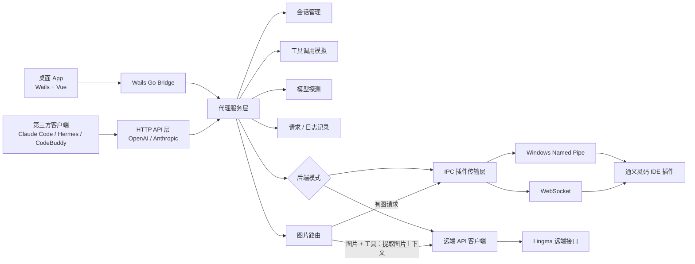

# Lingma Proxy

[English](./README.md) | [简体中文](./README.zh-CN.md)

**Lingma Proxy** 是一个通义灵码 API 适配层。它可以通过默认推荐的远端 API 模式直接调用 Lingma 远端接口，也可以把 Lingma 插件的本地私有 IPC / WebSocket 能力转换成标准 **OpenAI 兼容接口** 和 **Anthropic 兼容接口**，让 Claude Code、Hermes、CodeBuddy、Codex CLI、OpenCode、自研 Agent 等第三方客户端可以直接调用 Lingma 后端模型。

## 模型可用性说明

模型可用性并不是所有 Lingma 用户都完全一致。

- 本仓库里的截图、推荐模型和示例，基于维护者当前使用的 Lingma 企业版环境。
- 这**不代表**个人账号、其他商业账号或其他企业租户也一定会看到同样的模型目录。
- 实际能看到哪些模型，取决于 Lingma 账号类型、企业租户、远端 API 域名、地域、产品套餐以及服务端当前分配的模型权限。
- Lingma Proxy 正常情况下不会凭空生成这些模型，也不会静默删除；`/v1/models` 主要反映当前 Lingma 后端真实返回的模型集合。

项目同时提供两种使用方式：

- **CLI 代理服务**：适合后台常驻、脚本化和服务器式运行。
- **跨平台桌面 App**：适合日常可视化管理，支持 macOS 和 Windows。

代理后端支持两种模式：

- **远端 API 模式（默认，推荐）**：读取 Lingma 本地登录缓存或显式凭据，直接调用 Lingma 远端接口。它更接近普通托管 API，不依赖 IDE 插件窗口、IPC 会话和插件执行环境；目前更推荐给 Claude Code / Hermes 这类本地 Agent。
- **IPC 插件模式**：连接本机 Lingma IDE 插件的 WebSocket / Named Pipe。它更接近 IDE 插件上下文，但会继承 IDE 会话生命周期、插件本地状态和环境限制，主要作为兼容性兜底。

## 运行前提与深度思考边界

- 对 Claude Code、Codex CLI、Hermes Agent、CodeBuddy 等客户端，代理进程必须在请求进行期间持续运行。如果桌面 App 或 CLI 代理在流式响应中被手工退出，当前这轮请求需要由客户端重新发起。
- **远端 API 模式** 只透传 reasoning / thinking 的请求意图。模型本身仍然可能在内部进行了推理，但当前上游 Lingma 远端 SSE 不会返回独立的结构化 thinking / reasoning block，因此代理拿不到这类结构化内容，也不会伪造这类返回。
- **IPC 插件模式** 可以透传 Lingma IDE 本地协议里的独立 thinking 流，但前提是客户端显式请求 reasoning，且 Lingma IPC 上游真实返回了 thought chunk。当前本机实测里，Hermes CLI 和 Claude Code 都已经在 IPC 模式下真实显示出独立的 reasoning / thinking 内容；其中 Claude Code 依赖代理把 `thinking.type=adaptive` 正确识别为启用 reasoning。

## 当前版本

<!-- VERSION:CURRENT:BEGIN -->
当前桌面端版本：`v1.5.4.1`。

唯一来源是 [VERSION](./VERSION)。执行 `./scripts/sync-version.sh` 会把它同步到 [desktop/wails.json](./desktop/wails.json)、桌面 UI 和面向发布的文档块。
<!-- VERSION:CURRENT:END -->

版本更新记录见 [CHANGELOG.md](./CHANGELOG.md)。

GitHub Actions 会在 Release 中产出：

| 产物 | 平台 | 用途 |
| --- | --- | --- |
| `lingma-proxy_<tag>_darwin_arm64.tar.gz` | macOS | CLI 代理 |
| `lingma-proxy_<tag>_windows_amd64.zip` | Windows | CLI 代理 |
| `lingma-proxy-desktop_<tag>_darwin_arm64.dmg` | Apple Silicon Mac | 拖拽安装桌面 App |
| `lingma-proxy-desktop_<tag>_darwin_arm64.zip` | Apple Silicon Mac | `.app` 压缩包 |
| `lingma-proxy-desktop_<tag>_windows_amd64.zip` | Windows | 桌面 App |
| `lingma-proxy_<tag>_sha256.txt` | 全平台 | 校验文件 |

### 应该下载哪个包？

| 你的系统 | 推荐下载 | 说明 |
| --- | --- | --- |
| Apple Silicon Mac（M1/M2/M3/M4） | `lingma-proxy-desktop_<tag>_darwin_arm64.dmg` | 打开 DMG 后把 `Lingma Proxy.app` 拖到 `Applications`。 |
| Apple Silicon Mac，想要压缩包 | `lingma-proxy-desktop_<tag>_darwin_arm64.zip` | 和 DMG 是同一个 App，只是 zip 形式。 |
| Windows x64 / x86_64 / AMD64 | `lingma-proxy-desktop_<tag>_windows_amd64.zip` | 普通 64 位 Windows 电脑都选这个，包括 Intel 和 AMD CPU。 |
| 只想在 macOS 终端跑 CLI | `lingma-proxy_<tag>_darwin_arm64.tar.gz` | 只有命令行代理，没有桌面界面。 |
| 只想在 Windows 终端跑 CLI | `lingma-proxy_<tag>_windows_amd64.zip` | 只有命令行代理，没有桌面界面。 |

目前没有单独的 `windows_arm64` 包。常见 x64 Windows 机器请选择 `windows_amd64`。

## 功能概览

| 能力 | 状态 |
| --- | --- |
| OpenAI Chat Completions | 支持流式 / 非流式 |
| Anthropic Messages | 支持流式 / 非流式 |
| `GET /v1/models` | 支持 |
| Function Calling / Tools | 支持，使用工具调用模拟实现 |
| 多轮 Agent 工具循环 | 支持 |
| 图片输入 | 支持 base64、data URL、HTTP URL |
| 远端模式图片兜底 | 有图请求使用 IPC 图片链路；图片 + 工具请求先提取图片上下文，再回到 Remote API 原生工具调用 |
| 请求 / 响应完整日志 | 桌面端支持完整查看和复制 |
| 后端模式切换 | 支持 IPC 插件模式 / 远端 API 模式 |
| macOS WebSocket 自动探测 | 支持 |
| Windows Named Pipe / WebSocket 探测 | 支持 |
| 日间 / 夜间 / 跟随系统主题 | 桌面端支持 |
| macOS 窗口生命周期 | 关闭隐藏、Dock 重新打开、Cmd+W、Cmd+M、Cmd+Q |
| GitHub Release 打包 | macOS + Windows，CLI + Desktop |

## 桌面 App

桌面端是一个 Wails + Vue 实现的本地控制台，用来管理代理进程和观察真实请求。

主要页面：

- **仪表盘**：代理状态、监听地址、启动 / 停止 / 重启、健康延迟、模型摘要、配置摘要、最近请求；点击最近请求可直接跳转到请求流详情。
- **请求流**：查看 OpenAI / Anthropic 兼容接口的请求记录，支持搜索、筛选、清空、完整请求体 / 响应体查看和复制。
- **模型**：探测 Lingma 插件暴露的可用模型，点击模型复制模型 ID。模型选择由调用方请求里的 `model` 字段决定，App 不再做无意义的全局切换。
- **设置**：主机、端口、传输方式、超时、WebSocket 地址、Named Pipe、工作目录、当前文件、会话策略等。
- **日志**：代理启动、模型同步、健康检查、配置保存、错误事件等。
- **反馈导出**：支持导出脱敏后的反馈压缩包，包含应用日志、请求日志、配置摘要、运行环境与探测信息，便于提交 Issue 或离线反馈。

### 截图

日间模式：


夜间模式：


窄窗口 / 小屏布局：


## 支持的协议和接口

### HTTP 端点

| 端点 | 方法 | 说明 |
| --- | --- | --- |
| `/` | GET / HEAD | 健康检查；`HEAD /` 用于兼容 Claude Code 等客户端的基础探测 |
| `/health` | GET / HEAD | 健康检查 |
| `/v1/models` | GET | 获取 Lingma 可用模型列表 |
| `/capabilities` / `/v1/capabilities` | GET | 能力探测，给第三方 Agent 识别协议、工具、图片能力 |
| `/debug/requests` | GET | 查询最近 HTTP 请求检查记录 |
| `/debug/access-logs` / `/debug/logs` | GET | 查询最近 HTTP 访问日志摘要（`/debug/logs` 为兼容别名） |
| `/api/requests` / `/api/access-logs` / `/api/logs` | GET | 请求 / 访问日志调试接口别名 |
| `/api/v1/models` / `/api/tags` / `/props` | GET | LM Studio / Ollama / llama.cpp / vLLM 风格探测兼容 |
| `/v1/chat/completions` | POST | OpenAI Chat Completions 兼容接口 |
| `/api/v1/chat/completions` | POST | OpenAI Chat Completions 别名 |
| `/v1/responses` / `/api/v1/responses` | POST | OpenAI Responses 兼容接口，Codex CLI 依赖该接口 |
| `/v1/messages` | POST | Anthropic Messages 兼容接口 |

## 我们自己增强的能力

相对最初的协议验证版本，本仓库重点把它完善成一个可日常使用的本地代理产品：

- **Function Calling / Tools 兼容**：同时兼容 OpenAI `tools/tool_choice` 和 Anthropic `tools/tool_choice`。
- **工具结果接力**：支持多轮 Agent 工具调用，把工具结果继续回灌给 Lingma 生成最终回答。
- **工具稳定性增强**：代理层自动生成工具路由表，给 `read_file` / `search_files` / `terminal` / `web_search` 注入专门示例；当模型说“无法访问 / 请手动运行 / 请粘贴文件”时自动重试工具调用。
- **工具别名映射**：兼容常见模型输出的 `Bash` -> `terminal`、`Read` -> `read_file`、`Grep` -> `search_files`、`Edit` -> `patch`。
- **Anthropic 流式工具调用增强**：当 Claude Code 这类客户端使用 `stream=true` 并携带 tools 时，代理会先在内部完成工具 action block 解析和拒绝重试，再输出标准 `tool_use` 流，避免提前把“请你自己运行命令”这类文本发给客户端。
- **图片输入**：兼容 OpenAI `image_url` 和 Anthropic base64 image block。
- **本地图片路径兼容**：OpenAI `image_url.url` 支持 data URL、HTTP URL、`file://`、绝对路径和 `~/` 路径。
- **图片自动压缩**：大图会自动缩放并转 JPEG，避免 Lingma 被超大 base64 卡死。
- **日志图片脱敏**：桌面端请求详情会把图片 base64 标记为图片载荷，不再把巨大字符串撑爆 UI。
- **更完整的参数兼容**：接收 `temperature`、`top_p`、`stop`、`max_tokens`、`response_format`、`reasoning_effort` 等客户端常用字段。
- **完整请求 / 响应观测**：桌面端可以查看完整请求体、响应体、状态码、耗时和错误日志，便于排查 Claude Code / Hermes 等客户端的 400、500 问题。
- **跨平台桌面 App**：提供启动、停止、重启、模型探测、设置、日志、主题、窗口生命周期等完整桌面能力。
- **跨平台 Release**：GitHub Actions 同时打包 macOS / Windows 的 CLI 和桌面 App。

### OpenAI 兼容内容

支持常见 OpenAI 请求字段：

- `model`
- `messages`
- `stream`
- `temperature`
- `top_p`
- `stop`
- `max_tokens`
- `max_completion_tokens`
- `presence_penalty`
- `frequency_penalty`
- `tools`
- `tool_choice`
- `parallel_tool_calls`
- `response_format`
- `seed`
- `user`
- `reasoning_effort`
- `image_url`

说明：部分生成参数取决于 Lingma 后端是否实际采纳，代理层会尽量接收、归一化并保持客户端兼容。

### Anthropic 兼容内容

支持常见 Anthropic 请求字段：

- `model`
- `system`
- `messages`
- `stream`
- `temperature`
- `top_p`
- `top_k`
- `stop_sequences`
- `max_tokens`
- `metadata`
- `tools`
- `tool_choice`
- `tool_result`
- base64 图片块

### Deep Thinking / Reasoning 支持说明

深度思考支持和后端模式有关：

| 后端模式 | 请求意图 | 结构化 reasoning 返回 |
| --- | --- | --- |
| 远端 API | 透传 | 当前上游远端 SSE 不提供独立 reasoning block；这表示上游响应结构没有暴露独立思考块，并不等于模型没有进行内部推理 |
| IPC 插件 | 透传 | 当 Lingma IPC 返回 `agent_thought_chunk` 时支持 |

当前行为：

- Anthropic `/v1/messages`
  - 远端模式：接受 `thinking` 参数，但通常只返回普通 `text` block。这并不代表模型没有思考，而是上游远端 API 没有把思考过程作为独立 block 返回。
  - IPC 模式：当请求带 reasoning / thinking，且 Lingma IPC 确实返回独立 thought chunk 时，非流式返回单独 `thinking` block，流式返回 `thinking_delta`。
- OpenAI `/v1/responses`
  - 远端模式：接受 `reasoning` 参数，但不会额外暴露独立 `reasoning` item，因为上游远端流本身没有这个结构。这是上游响应形态的限制，不是代理把已有 reasoning 过滤掉了。
  - IPC 模式：当请求带 reasoning，且 Lingma IPC 返回独立 thought chunk 时，非流式返回单独 `reasoning` item，流式返回 `response.reasoning_summary_*` 事件。

代理不会凭空生成上游没有真实返回的思维链内容。

真实客户端 IPC 展示验证：

- **Hermes CLI**：已确认端到端可见。代理会发出 `thinking_delta`，Hermes CLI 会先展示独立 `Reasoning` 面板，再输出最终正文。
- **Claude Code**：已确认端到端可见。真实请求携带 `thinking.type=adaptive`，代理会正确保留并返回独立 `thinking` block；Claude Code 的 `stream-json` 输出可见这段 thinking stream，随后再输出最终正文。

### IPC 思考过程兼容矩阵（真实客户端）

下面这张表对三个客户端统一使用同一条复杂固定探针：

> `请比较 9.11 和 9.8 的大小，要求分步骤解释为什么；如果存在独立 reasoning 字段，请单独返回，不要把推理过程折叠进最终答案。`

其中“IPC 协议层结构化 reasoning”表示直接通过 Lingma Proxy 的 IPC 路径探针（`/v1/messages` 或 `/v1/responses`）已经确认：Lingma IPC 上游确实发出了独立 thought chunk，且代理已经把它映射成结构化 thinking / reasoning 返回；“客户端展示”表示最终用户在该客户端里是否真的看到了独立思考面板/区块。

| 模型 | IPC 协议层结构化 reasoning | Claude Code + IPC | Hermes CLI + IPC | Codex CLI + IPC |
| --- | --- | --- | --- | --- |
| `Auto` | ✅ | ✅ 可见独立 thinking block | ✅ 可见 `Reasoning` 面板 | ❌ 未显示独立 reasoning item |
| `Kimi-K2.6` | ✅ | ✅ 可见独立 thinking block | ❌ 当前 Hermes 请求形态下未显示独立 reasoning 面板 | ❌ 未显示独立 reasoning item |
| `MiniMax-M2.7` | ✅ | ✅ 可见独立 thinking block | ✅ 可见 `Reasoning` 面板 | ❌ 未显示独立 reasoning item |
| `Qwen3-Coder` | ❌ | ❌ 无结构化 thinking block | ❌ 未显示独立 reasoning 面板 | ❌ 未显示独立 reasoning item |
| `Qwen3-Max` | ❌ | ❌ 无结构化 thinking block | ❌ 未显示独立 reasoning 面板 | ❌ 未显示独立 reasoning item |
| `Qwen3-Thinking` | ✅ | ✅ 可见独立 thinking block | ✅ 可见 `Reasoning` 面板 | ✅ 已显示独立 reasoning item |
| `Qwen3.6-Plus` | ✅ | ✅ 可见独立 thinking block | ✅ 可见 `Reasoning` 面板 | ❌ 未显示独立 reasoning item |

说明：

- **远端 API 模式不在这个矩阵里**，因为当前上游远端 SSE 仍然不会返回独立的结构化 reasoning block。模型可能仍然做了内部推理，只是远端 API 没有把它作为结构化内容返回给代理。
- 某个模型“协议层已经返回 thought chunk”，**不等于** 每个客户端都会把它显示成独立思考面板。Claude Code、Hermes、Codex 的请求形态和展示规则都不同。
- 当前最稳的统一结论是：如果你希望在三个已测试 IPC 客户端里都尽量看到独立思考过程，优先使用 **`Qwen3-Thinking`**。
- `Kimi-K2.6` 是一个典型例子：IPC 协议层能返回 thought chunk，Claude Code 能显示，但当前 Hermes / Codex 这套真实请求与展示路径还不会把它单独显示出来。

### 图片兼容与实测范围

图片能力分两层：代理协议层先兼容 OpenAI / Anthropic 的图片请求格式，再用真实客户端形态做回归验证。当前状态如下：

| 客户端 / 请求形态 | 状态 | 说明 |
| --- | --- | --- |
| OpenAI Chat Completions `image_url` data URL | 已验证 | 通过 `/v1/chat/completions` 实测，模型可以正确描述图片内容。 |
| OpenAI Chat Completions `image_url` 本地路径 / `file://` | 代理层支持 | 代理会读取并归一化本地文件，再交给图片链路。 |
| Anthropic Messages base64 image block | 已验证 | 通过 `/v1/messages` 实测，模型可以正确描述图片内容。 |
| Claude Code 粘贴图片 | 已验证 | 已用 Claude Code 风格的 Anthropic 请求实测：长上下文、tools、base64 图片块和 Claude image-cache 路径标记同时存在时可用。 |
| Claude Code 粘贴图片 + tools | 已验证 | 远端模式会先用 IPC 提取最新图片轮次的上下文，再回到 Remote API 原生工具调用。 |
| Hermes CLI `hermes chat --image` | 已验证 | 使用 `--provider custom --model kmodel --image /Users/tiancheng/Pictures/ik2.jpg` 实测；Hermes 会向 `/v1/chat/completions` 发送 OpenAI `image_url`，模型可以正确描述图片内容。 |
| OpenClaw `infer image describe --file` | 已验证 | 配置 `lingma-proxy/kmodel` 为 `text+image` 后实测；OpenClaw 会发送 OpenAI `image_url`，模型可以正确描述图片内容。 |
| OpenClaw `agent` 图片标记 | 部分验证 | 图片文件进入 OpenClaw 每个 session 的 sandbox 后可用；直接引用 `/Users/.../Pictures/ik2.jpg` 会先被 OpenClaw 自己的沙盒拒绝，尚未作为图片请求进入代理。 |
| 自研 Agent 使用标准 OpenAI 或 Anthropic 图片请求 | 预期兼容 | 只要它们发出的请求是 OpenAI `image_url` 或 Anthropic base64 image block，就走同一条已验证链路；它们自己的微信网关、截图发送、文件投递属于客户端侧能力，不属于代理图片输入能力。 |

关键限制和行为：

- 远端 API 模式的图片理解仍依赖 Lingma IPC 图片链路，因为直连远端聊天接口不会稳定消费本地 `file://` 和 data URL 图片。
- 如果请求同时包含图片和工具，代理会只取“最后一条带图片的用户消息”构造一个紧凑的 IPC 图片理解请求，把得到的图片上下文追加回原请求，再交给 Remote API 原生工具调用。
- 因此图片请求要求 Lingma App / IDE 插件保持运行；如果 Lingma 被彻底退出，纯文本 Remote API 仍可工作，但图片理解会失败并提示重新打开 Lingma。
- 请求日志会脱敏大段图片 base64，只保留图片载荷标记，避免日志 UI 被撑爆。

## 架构设计



### 目录结构

| 路径 | 职责 |
| --- | --- |
| `cmd/lingma-ipc-proxy` | CLI 入口，配置加载，HTTP 服务启动，系统信号处理 |
| `internal/httpapi` | OpenAI / Anthropic 路由、请求解析、SSE 流式响应、请求记录 |
| `internal/service` | 业务编排、会话生命周期、模型探测、代理运行状态 |
| `internal/lingmaipc` | Lingma JSON-RPC 通信，Named Pipe / WebSocket 传输 |
| `internal/remote` | Lingma 远端 API 登录态读取、签名、模型列表和流式响应解析 |
| `internal/toolemulation` | 工具定义注入、动作块解析、工具结果回灌 |
| `desktop` | Wails 桌面壳、窗口命令、代理生命周期桥接 |
| `desktop/frontend` | Vue 前端页面，包含仪表盘、请求流、模型、设置、日志 |
| `docs/images` | README 截图素材 |
| `.github/workflows/release.yml` | macOS / Windows CLI + Desktop release 打包 |

### 请求链路

1. 客户端请求 `http://127.0.0.1:8095/v1/chat/completions` 或 `/v1/messages`。
2. HTTP 层识别 OpenAI / Anthropic 请求格式。
3. Service 层归一化消息、图片、工具定义和参数。
4. Session 管理层决定复用会话、创建新会话或使用自动策略。
5. Service 根据 `backend` 选择 IPC 插件传输或 Lingma 远端 API。
6. Lingma 插件或远端接口返回增量事件 / 最终响应。
7. HTTP 层转换成 OpenAI SSE、Anthropic SSE 或普通 JSON。
8. 桌面端同步记录请求、响应、耗时、状态码和日志。

## Lingma 路径自动探测

| 平台 | 优先传输 | 探测方式 |
| --- | --- | --- |
| macOS | WebSocket | 扫描 Lingma `SharedClientCache`、`~/.lingma` 等用户目录 |
| Windows | Named Pipe / WebSocket | 扫描 Lingma 命名管道，以及 `%APPDATA%`、`%LOCALAPPDATA%`、`%ProgramData%`、`%USERPROFILE%\.lingma` 下的共享缓存信息 |
| Linux | WebSocket | 尝试读取 `~/.lingma` / XDG 目录，仍建议必要时手动指定 `--ws-url` |

如果自动探测失败，桌面端会提供兜底说明。可以在设置里手动填写：

- macOS WebSocket 示例：`ws://127.0.0.1:36510`
- Windows Named Pipe 示例：`\\.\pipe\lingma-ipc`
- 代理监听地址示例：`http://127.0.0.1:8095`

CLI 也可以手动指定：

```bash
lingma-proxy --transport websocket --ws-url ws://127.0.0.1:36510 --port 8095
lingma-proxy --transport pipe --pipe '\\.\pipe\lingma-ipc'
```

## 后端模式

### 远端 API 模式（默认，推荐）

远端模式直接调用 Lingma 远端接口：

```bash
lingma-proxy --backend remote --port 8095
```

默认会只读导入：

```text
~/.lingma/cache/user
~/.lingma/cache/id
~/.lingma/logs/lingma.log
%APPDATA%\Lingma\cache\user
%LOCALAPPDATA%\Lingma\cache\user
存在时也会尝试 XDG 配置 / 状态目录
```

也可以指定显式凭据文件：

```bash
lingma-proxy \
  --backend remote \
  --remote-base-url https://lingma.alibabacloud.com \
  --remote-auth-file ~/.config/lingma-proxy/credentials.json
```

`credentials.json` 格式：

```json
{
  "source": "manual",
  "token_expire_time": "1777520000000",
  "auth": {
    "cosy_key": "xxx",
    "encrypt_user_info": "xxx",
    "user_id": "123",
    "machine_id": "xxxxxxxxxxxxxxxx"
  }
}
```

说明：

- 远端 API 模式是日常 Agent 使用的默认推荐模式。它绕过 IDE / 插件 IPC 运行时，因此更少受到插件会话、IDE 当前项目和本地扩展环境限制影响。
- 远端模式不会写入或迁移你的登录态，只会读取本机 Lingma 缓存或你指定的凭据文件。
- 如果 Lingma 插件配置过专属域名，远端模式会优先使用 `--remote-base-url`、`LINGMA_REMOTE_BASE_URL` 或配置文件；这些为空时，会扫描 macOS、Windows、Linux 上 Lingma 本地日志里的 `endpoint config:`、Marketplace service URL 等线索。
- 桌面端设置页会展示当前解析到的远端域名和来源，但不会展示 token / key 明文。
- 远端模式的 `/v1/models` 返回的是远端接口模型 key，不一定等同于 IPC 插件模式里看到的 `MiniMax-M2.7`、`Kimi-K2.6` 等展示名。
- 即使成功导入了远端登录态，模型集合也可能和本仓库示例不同。尤其是 `Kimi-K2.6`、`MiniMax-M2.7`、部分 `Qwen3` 变体、`Auto / org_auto`，都可能随着账号和租户不同而变化。
- 远端模式下的图片请求会自动走 IPC 图片链路，因为直连远端聊天接口不会直接消费本地 `file://` 和 data URL 图片。若请求同时带工具，代理会先通过 IPC 提取图片上下文，再把不含图片但包含上下文的请求交给 Remote API 原生工具调用。
- 当前本机实测：`/health`、`/v1/models`、OpenAI 流式 / 非流式、Claude Code Anthropic + Bash 工具调用均可用；Claude Code 完整工具链耗时明显高于简单 OpenAI 请求。
- 该模式参考了 [ZipperCode/lingma2api](https://github.com/ZipperCode/lingma2api) 对 Lingma 远端接口、签名和登录态结构的探索，本仓库将其作为可切换后端集成到现有 OpenAI / Anthropic / 桌面 App 架构中。

### IPC 插件模式

IPC 模式通过本机 Lingma IDE 插件通信：

```bash
lingma-proxy --backend ipc --transport auto --port 8095
```

适合已经打开 VS Code / Lingma 插件、希望使用插件当前会话环境、并优先使用插件探测模型列表的场景。相比远端 API 模式，IPC 插件模式更依赖 IDE / 插件进程，也更容易受到插件会话、当前项目和本地环境的影响。

## 快速开始

### 前置条件

1. 安装 VS Code。
2. 安装通义灵码插件：`Alibaba-Cloud.tongyi-lingma`。
3. 登录通义灵码账号。
4. 在 VS Code 中确认 Lingma 面板可以正常聊天。

### 使用桌面 App

1. 前往 [Releases](https://github.com/Lutiancheng1/lingma-proxy/releases) 下载桌面版。
2. macOS 解压后打开 `Lingma Proxy.app`。
3. Windows 解压后运行桌面版 exe。
4. 点击启动代理。
5. 点击 `探测模型`。
6. 在 Claude Code / Hermes / CodeBuddy 中配置本地地址。

### 使用 CLI

macOS：

```bash
git clone https://github.com/Lutiancheng1/lingma-proxy.git
cd lingma-proxy
go build -o ./dist/lingma-proxy ./cmd/lingma-ipc-proxy
./dist/lingma-proxy --host 127.0.0.1 --port 8095 --session-mode auto
```

Windows：

```powershell
git clone https://github.com/Lutiancheng1/lingma-proxy.git
cd lingma-proxy
.\scripts\build.ps1
.\dist\lingma-proxy.exe --host 127.0.0.1 --port 8095 --session-mode auto
```

## 客户端配置

下面这些配置示例都来自我们已经实际联调通过的客户端，但它们**不代表所有 Lingma 账号都会看到相同模型**。

- 下面示例里的模型 ID 来自我们自己的企业版 Lingma 环境。
- 个人版、商业版、校园版、不同企业租户、不同远端域名，可能会返回不同的模型集合、别名、额度和能力。
- 以你自己实际请求 `/v1/models` 的返回结果为准，不要把本仓库截图或 README 里的模型当成所有环境的固定真相。

### 已验证客户端兼容性

| 客户端 | 状态 | 已验证功能 | 备注 |
| --- | --- | --- | --- |
| **Claude Code** | ✅ 完整测试 | 文本聊天、工具调用、图片输入、图片+工具 | Anthropic API 兼容 |
| **Hermes Agent** | ✅ 完整测试 | 文本聊天、工具编程任务、`--image` 图片理解 | OpenAI API 兼容 |
| **CodeBuddy** | ✅ 完整测试 | 标准聊天、token 统计 | OpenAI 兼容自定义模型 |
| **Codex CLI** | ✅ 完整测试 | 纯文本执行、多步工具调用、文件修改+diff、图片输入、图片+工具后续调用 | 需要 `/v1/responses` 端点，配置 `wire_api = "responses"`；已基于 `desktop/wails.json` 定义的当前桌面版本线实测，重试恢复也已验证 |

### Claude Code

参考：Anthropic Claude Code 官方文档：[code.claude.com/docs/en/overview](https://code.claude.com/docs/en/overview)

```bash
export ANTHROPIC_BASE_URL="http://127.0.0.1:8095"
export ANTHROPIC_API_KEY="any"
```

然后在 Claude Code 中选择模型：

```text
/model kmodel
```

补充说明：

- `ANTHROPIC_BASE_URL` 不要带 `/v1`，Claude Code 会自己追加 Anthropic 路径。
- 本地已验证：普通文本、tools、粘贴图片、图片 + tools 同轮请求都可用。
- IPC 思考透传补充：Claude Code 的 `thinking.type=adaptive` 现在会被代理正确识别，不会再被误当成关闭 reasoning。基于本机 IPC 实测，代理返回了独立 `thinking` block，Claude Code 的 `stream-json` 输出也能看到这段 thinking stream。
- Claude Code + IPC 逐模型复杂探针结果：`Auto`、`Kimi-K2.6`、`MiniMax-M2.7`、`Qwen3-Thinking`、`Qwen3.6-Plus` 都能看到独立思考；`Qwen3-Coder`、`Qwen3-Max` 不能。

### Hermes Agent

参考：Hermes 官方 providers 集成文档：[NousResearch/hermes-agent providers.md](https://github.com/NousResearch/hermes-agent/blob/main/website/docs/integrations/providers.md)

环境变量示例（`~/.hermes/.env`）：

```bash
OPENAI_API_KEY=any
```

配置示例（`~/.hermes/config.yaml`）：

```yaml
providers:
  custom:
    api_key_env: OPENAI_API_KEY
    base_url: http://127.0.0.1:8095/v1
    models:
      - id: kmodel
        label: Lingma Proxy Kimi

default_provider: custom
default_model: kmodel
```

本地已验证：普通文本对话、带工具的代码任务、`hermes chat --image` 图片理解。

IPC 思考透传补充：

- Hermes IPC 模式已完整坐实：开启 reasoning 后，代理会输出 `thinking_delta`，Hermes CLI 会真实显示独立 `Reasoning` 面板。
- Hermes + IPC 逐模型复杂探针结果：`Auto`、`MiniMax-M2.7`、`Qwen3-Thinking`、`Qwen3.6-Plus` 会显示独立 `Reasoning` 面板；`Kimi-K2.6`、`Qwen3-Coder`、`Qwen3-Max` 在当前 Hermes 请求形态下不会。

### CodeBuddy

CodeBuddy 目前没有公开更细的 Lingma Proxy 官方接入文档可直接引用。下面这份是我们在 CodeBuddy 自定义 OpenAI 兼容模型导入流程里实测通过的配置形态。

```json
{
  "name": "Lingma Proxy",
  "provider": "openai-compatible",
  "baseURL": "http://127.0.0.1:8095/v1",
  "apiKey": "any",
  "model": "kmodel"
}
```

本地已验证：标准聊天请求可以正常调用，并且 token usage 统计可被桌面端识别。

### Codex CLI

参考：OpenAI Codex CLI 官方总览：[developers.openai.com/codex/cli](https://developers.openai.com/codex/cli)。下面这份 provider 配置是我们基于 `codex-cli 0.130.0` 的本地实测结果。

本地实测可用的 provider 配置如下：

```toml
model = "kmodel"
model_provider = "lingma_proxy"
approval_policy = "never"
sandbox_mode = "danger-full-access"

[model_providers.lingma_proxy]
name = "Lingma Proxy"
base_url = "http://127.0.0.1:8095/v1"
env_key = "OPENAI_API_KEY"
wire_api = "responses"
```

```bash
export OPENAI_API_KEY="any"
codex exec --skip-git-repo-check --dangerously-bypass-approvals-and-sandbox --json '只回复 OK'
```

如果你希望 Codex CLI 在 `kmodel`、`Qwen3-Thinking` 这类 Lingma 自定义模型 ID 上真正向 `/v1/responses` 发送 `reasoning`，还需要额外提供 `model_catalog_json`。仅配置 `wire_api = "responses"` 还不够；对未知自定义模型，Codex 会回退到不带 reasoning 的默认能力元数据。

示例 catalog（`/绝对路径/codex-model-catalog.json`）：

```json
{
  "models": [
    {
      "slug": "kmodel",
      "display_name": "Kimi-K2.6",
      "description": "Lingma 远端 Kimi 模型",
      "default_reasoning_level": "high",
      "supported_reasoning_levels": [
        { "effort": "low", "description": "快速思考" },
        { "effort": "medium", "description": "平衡思考" },
        { "effort": "high", "description": "深度思考" },
        { "effort": "xhigh", "description": "最高强度思考" }
      ],
      "supports_reasoning_summaries": true,
      "default_reasoning_summary": "detailed",
      "input_modalities": ["text", "image"]
    },
    {
      "slug": "Qwen3-Thinking",
      "display_name": "Qwen3-Thinking",
      "description": "Lingma 远端 Qwen 推理模型",
      "default_reasoning_level": "high",
      "supported_reasoning_levels": [
        { "effort": "low", "description": "快速思考" },
        { "effort": "medium", "description": "平衡思考" },
        { "effort": "high", "description": "深度思考" },
        { "effort": "xhigh", "description": "最高强度思考" }
      ],
      "supports_reasoning_summaries": true,
      "default_reasoning_summary": "detailed",
      "input_modalities": ["text", "image"]
    }
  ]
}
```

然后在 Codex CLI 配置里显式指向它：

```toml
model = "kmodel"
model_provider = "lingma_proxy"
approval_policy = "never"
sandbox_mode = "danger-full-access"
model_catalog_json = "/绝对路径/codex-model-catalog.json"
model_reasoning_effort = "high"
model_reasoning_summary = "detailed"
show_raw_agent_reasoning = true

[model_providers.lingma_proxy]
name = "Lingma Proxy"
base_url = "http://127.0.0.1:8095/v1"
env_key = "OPENAI_API_KEY"
wire_api = "responses"
```

这部分我们已经做过本地 A/B 验证：

- 不带 `model_catalog_json` 时，Codex CLI 对 `kmodel` / `Qwen3-Thinking` **不会**发送 `reasoning`
- 带 `model_catalog_json` 后，Codex CLI 会发送：
  - `reasoning: {"effort":"high","summary":"detailed"}`
  - `include: ["reasoning.encrypted_content"]`
- 即便如此，当前 **Remote API** 上游返回仍然只有普通 `delta.content` 文本分片。它可能把“推理过程：...”混在正文里返回，但**不会**单独返回结构化 reasoning block。
- 因此这里剩余的限制不在 Lingma Proxy 的 `/v1/responses` 映射，而在 Remote API 上游本身的响应结构；这也不应被误解成“模型没有思考”。

Codex CLI 在 **IPC 模式** 下的 thinking 展示结论，需要和“协议层是否支持”分开看。下面这张表使用的是固定复杂探针：

> `请比较 9.11 和 9.8 的大小，要求分步骤解释为什么；如果存在独立 reasoning 字段，请单独返回，不要把推理过程折叠进最终答案。`

| 模型 | 直接调用 `/v1/responses`（IPC，带 reasoning） | Codex CLI + IPC + `model_catalog_json` 实际展示 |
| --- | --- | --- |
| `Auto` | ✅ 返回独立 `reasoning` item | ❌ 未显示独立 reasoning item |
| `Kimi-K2.6` | ✅ 返回独立 `reasoning` item | ❌ 未显示独立 reasoning item |
| `MiniMax-M2.7` | ✅ 返回独立 `reasoning` item | ❌ 未显示独立 reasoning item |
| `Qwen3-Coder` | ❌ 未返回独立 `reasoning` item | ❌ 未显示独立 reasoning item |
| `Qwen3-Max` | ❌ 未返回独立 `reasoning` item | ❌ 未显示独立 reasoning item |
| `Qwen3-Thinking` | ✅ 返回独立 `reasoning` item | ✅ 已显示独立 reasoning item |
| `Qwen3.6-Plus` | ✅ 返回独立 `reasoning` item | ❌ 未显示独立 reasoning item |

说明：

- 左列代表 **代理协议层** 能不能从 IPC 上游拿到独立 thought chunk，并映射成 Responses `reasoning` item。
- 右列代表 **Codex CLI 当前这套真实请求形态** 下，JSONL 里是否真的出现 `type=reasoning` 的独立展示项。
- 结论不能简单理解成“模型支持 thought chunk，就一定会被 Codex 展示出来”。Codex 自己的系统提示、客户端上下文、模型路由和本轮请求形态，都会影响最终是否真的吐出独立 reasoning 面板。
- 当前最稳的结论是：**如果你希望在 Codex CLI 里尽量看到独立思考过程，优先使用 `Qwen3-Thinking`。**
- 和 Claude Code / Hermes 相比，Codex IPC 对独立 reasoning 展示的要求目前最严格。

本地已验证：在补齐 `/v1/responses` 兼容后，下面这些场景都能通过代理执行：

- 纯文本执行（`只回复 OK`）
- 多步工具调用（`查看一下当前项目结构...`）
- 修改文件并返回 unified diff
- 图片输入（`codex exec --image /绝对路径.jpg -- '这张图片里是什么？'`）
- 图片 + 工具同轮请求（先描述图片，再继续执行文件编辑或命令调用）
- 桌面端重试恢复（停掉桌面端，让 Codex 进入重试，再重新打开 `8095` 上的桌面代理后继续成功）

图片 + 工具示例：

```bash
export OPENAI_API_KEY="any"
codex exec --skip-git-repo-check --dangerously-bypass-approvals-and-sandbox --json \
  --image /Users/tiancheng/Pictures/ik2.jpg \
  -- '先用一句话描述这张图片的氛围，再运行 pwd，并只返回命令结果。'
```

## 模型说明

模型列表来自 Lingma 插件，不是代理内置静态列表。桌面端仅负责展示和复制模型 ID，真正使用哪个模型由调用方请求里的 `model` 字段决定。

重要说明：下面列出的模型来自我们自己当前观察到的企业版 Lingma 环境。你的账号可能模型更少、别名不同，或者根本没有 `kmodel` / `mmodel` 这类远端模式 ID。

当前常见模型：

| 模型 | 说明 |
| --- | --- |
| `Auto` | Lingma 自动路由模型，桌面端使用通用自动图标 |
| `Qwen3-Coder` | 代码专项备选 |
| `Qwen3-Max` | 通用能力较强 |
| `Qwen3-Thinking` | 推理类模型 |
| `Qwen3.6-Plus` | 通用模型 |
| `Kimi-K2.6` | 多模态和长上下文模型 |
| `MiniMax-M2.7` | 速度优先备选 |

### 模型参数来源和推荐

代理不会凭空写死 Lingma 没公开的模型参数。下面的上下文长度和能力只在有官方或模型卡来源时写入；没有权威来源的模型只标注“本地实测”。

| 模型 | 推荐场景 | 参数 / 能力依据 |
| --- | --- | --- |
| `Kimi-K2.6`（远端模式 ID 为 `kmodel`） | 远端 API 模式和第三方 Agent 默认推荐 | Kimi [官方 API 文档](https://platform.kimi.ai/docs/guide/kimi-k2-6-quickstart) 标注原生 text/image/video、多步工具调用和 `256k` 上下文。本地 Claude Code 远端模式测试里工具执行更自然。 |
| `MiniMax-M2.7`（远端模式 ID 为 `mmodel`） | 速度优先备选 | NVIDIA 的 [MiniMax M2.7 模型卡](https://developer.nvidia.com/blog/minimax-m2-7-advances-scalable-agentic-workflows-on-nvidia-platforms-for-complex-ai-applications/) 标注 `200k` input context、MoE 语言模型和 agentic 场景；此前本地代理压测 read/search/terminal/web/patch/vision 全部通过，响应速度较快。 |
| `Qwen3-Coder` | 代码专项和工具协议备选 | Qwen [官方资料](https://github.com/qwenlm/qwen-code/blob/main/docs/users/configuration/model-providers.md) 明确其定位是代码专项模型。本仓库在 Lingma 集成场景下采用更保守的 `256k` 上下文文案，不把 `1M` 当作稳定默认能力宣传。 |
| `Qwen3.6-Plus` | 通用 / 视觉备选 | 按用户核对的阿里云百炼参数，`Qwen3.6-Plus` 为 `1M` 上下文窗口；在本地 Lingma Proxy 测试里适合作为通用 / 视觉备选。 |
| `Qwen3-Max` | 快速通用 / 视觉备选 | 按用户核对的阿里云百炼参数，`Qwen3-Max` 为 `256k` 上下文窗口；简单工具和视觉测试表现好，但强制 read/patch 场景在本代理里不如 MiniMax / Kimi 稳。 |
| `Qwen3-Thinking` | IPC 思考显示优先推荐 | 按用户核对的阿里云百炼参数，`Qwen3-Thinking` 为 `1M` 上下文窗口；如果你希望在已测试的 IPC 客户端里尽量看到独立思考过程，优先选它。 |

当客户端请求没有携带 `model` 字段时，代理默认使用：`kmodel`（远端模型列表里的 Kimi-K2.6）。

远端模式默认开启兜底。代理默认请求超时为 `0`，表示 Lingma Proxy 不设置自己的单次请求 deadline，适合长流程 Agent 任务。如果你把 `"timeout"` 设置为正数秒，超时错误也会触发兜底。上游 5xx/429 或网络中断不受超时设置影响，仍可触发兜底；但代理只会在尚未向客户端输出任何流式内容的情况下切换模型。兜底候选会先和实际 `/v1/models` 返回结果求交集，不存在或当前账号不可用的模型会自动跳过。默认顺序：

`Kimi-K2.6 -> MiniMax-M2.7 -> Qwen3-Coder -> Qwen3.6-Plus -> Qwen3-Max -> Qwen3-Thinking`

## 配置文件

默认读取：

```text
./lingma-proxy.json
./lingma-ipc-proxy.json
```

完整示例：

```json
{
  "host": "127.0.0.1",
  "port": 8095,
  "backend": "ipc",
  "transport": "auto",
  "remote_base_url": "",
  "remote_auth_file": "",
  "remote_version": "",
  "mode": "agent",
  "shell_type": "zsh",
  "session_mode": "auto",
  "timeout": 0,
  "remote_fallback_enabled": true,
  "remote_fallback_models": [
    "kmodel",
    "mmodel",
    "dashscope_qwen3_coder",
    "dashscope_qmodel",
    "dashscope_qwen_max_latest",
    "dashscope_qwen_plus_20250428_thinking"
  ],
  "cwd": "/Users/tiancheng/project",
  "current_file_path": ""
}
```

配置优先级从低到高：

1. 内置默认值
2. JSON 配置文件
3. 环境变量
4. 命令行参数
5. 桌面端设置页保存的配置

## 并发请求

旧版本为了避免 Lingma 会话串扰，在 HTTP 层做了全局单请求限制，所以并发请求会返回：

```json
{"error":{"message":"Lingma IPC proxy handles one request at a time.","type":"rate_limit_error"},"type":"error"}
```

现在已经改成有限并发执行池：

- 默认最多同时处理 `4` 个 Chat 请求。
- 可以用 `LINGMA_PROXY_MAX_CONCURRENT` 覆盖。
- 合法范围是 `1` 到 `16`。
- `session_mode=auto` 默认使用 fresh Lingma 会话，避免多个编辑器并发请求挤到同一个 sticky session 里串上下文。

示例：

```bash
LINGMA_PROXY_MAX_CONCURRENT=8 lingma-proxy --port 8095
```

## 工具调用实现

Lingma 插件本身没有公开标准 OpenAI / Anthropic Tools 协议，所以本项目使用 **Tool Emulation**：

1. 接收 OpenAI `tools` / Anthropic `tools`。
2. 将工具定义转成 Lingma 可理解的提示词上下文。
3. 引导模型输出结构化 action block。
4. 解析 action block。
5. 重新编码成 OpenAI `tool_calls` 或 Anthropic `tool_use`。
6. 将工具执行结果回灌给 Lingma，继续生成最终回答。

当前版本对工具调用做了这些增强：

- 根据客户端传入的工具名自动生成“工具路由表”。
- 对 `read_file`、`search_files`、`terminal`、`web_search` 注入专门示例。
- 当模型回答“无法访问文件 / 无法联网 / 请手动运行 / 请粘贴内容”时，代理会自动追加强制工具调用提示并重试一次。
- 自动归一化常见工具名别名：`Bash`、`Shell`、`Read`、`Grep`、`Edit`、`Fetch` 等。
- Anthropic `stream=true` 且请求包含 tools 时，会先内部完成生成和重试，再流式输出最终 `tool_use` 事件，避免 Claude Code 这类客户端先收到普通拒绝文本。

本地压测结果：`MiniMax-M2.7`、`Kimi-K2.6`、`Qwen3.6-Plus`、`Qwen3-Coder` 均通过 read/search/terminal/web/patch/vision 烟测。当前默认推荐远端 API 模式的 `kmodel`，因为它不受 Lingma IDE IPC 会话限制，在 Claude Code 和 Hermes 这类本地 Agent 场景更自然。

## 请求和日志观测

桌面端会记录：

- 请求时间
- HTTP 方法
- 路径
- 状态码
- 耗时
- 请求体
- 响应体
- 错误原因
- 代理运行日志

请求体和响应体不会再用无意义的展开 / 收起按钮截断展示；内容过长时会在详情区域内部滚动，并隐藏滚动条，便于小窗口下查看完整内容。

除了桌面端页面，HTTP 服务本身也提供只读调试接口，方便后续排查 Claude Code、Hermes、CodeBuddy 等客户端到底传了什么请求：

```bash
curl http://127.0.0.1:8095/health
curl -I http://127.0.0.1:8095/
curl 'http://127.0.0.1:8095/debug/requests?limit=20'
curl 'http://127.0.0.1:8095/debug/access-logs?limit=20'
```

说明：

- `/debug/requests` 和 `/debug/access-logs` 返回最新记录在前。
- `/debug/requests` 记录包含时间、HTTP 方法、路径、状态码、耗时、脱敏后的请求体和响应体。
- `/debug/access-logs` 记录包含时间、级别和汇总后的 HTTP 访问日志消息。
- 新接入建议优先使用 `/debug/access-logs` 和 `/api/access-logs`；`/debug/logs` 和 `/api/logs` 继续保留为同一条 HTTP access log 流的兼容别名。
- 服务端最多保留最近 200 条 HTTP 记录，只保存在内存中，重启后清空。
- 图片 payload 和大段 base64 会被标记脱敏，超长请求 / 响应会截断，避免日志页面被撑爆。
- 这些接口用于本机调试，不建议暴露到不可信网络。

## 本地构建桌面端

安装 Wails：

```bash
go install github.com/wailsapp/wails/v2/cmd/wails@v2.12.0
```

macOS：

```bash
npm ci --prefix desktop/frontend
cd desktop
wails build -platform darwin/arm64 -clean
```

Windows：

```powershell
npm ci --prefix desktop/frontend
cd desktop
wails build -platform windows/amd64 -clean
```

桌面端最终 App 名称统一为：

```text
Lingma Proxy
```

Release 资产文件名仍使用 `lingma-proxy-desktop_<tag>_...` 区分桌面端和 CLI 端。

## GitHub Actions Release

### 本地桌面版候选包流程

macOS 本地验证包必须统一走标准脚本，不要再手工执行退出 / 覆盖 / 打开：

```bash
./scripts/rebuild-local-app.sh
```

这个脚本固定执行：

1. 打包桌面端
2. 对已安装 App 发送 macOS 双次退出序列
3. 覆盖 `/Applications/Lingma Proxy.app`
4. 重新打开已安装 App

推荐的本地候选包验收顺序：

1. `go test ./...`
2. `npm run build --prefix desktop/frontend`
3. `./scripts/rebuild-local-app.sh`
4. 检查 `/Applications/Lingma Proxy.app` 版本号是否正确
5. 验证仪表盘、请求流、模型、设置、日志、反馈导出
6. 用 `http://127.0.0.1:8095/v1` 再跑一轮 Codex CLI 已验证冒烟用例

### GitHub Release 流程

发布方式：

```bash
VERSION=$(cat VERSION)
git tag "v$VERSION"
git push origin "v$VERSION"
```

也可以在 GitHub Actions 页面手动运行 `Release` workflow，并输入 tag。

Release workflow 会执行：

1. `go test ./...`
2. 构建 macOS CLI
3. 构建 Windows CLI
4. 构建 macOS 桌面 App
5. 构建 Windows 桌面 App
6. 生成 SHA256 校验文件
7. 上传到 GitHub Release

推荐的远端发布顺序：

1. 更新根级 `VERSION`
2. 在 [CHANGELOG.md](./CHANGELOG.md) 中补上同版本的独立条目：`## vX.Y.Z - YYYY-MM-DD`
3. 执行 `./scripts/release-check.sh`
4. 检查脚本生成的 diff 并提交
5. 把 release 提交推送到 `main`
6. 根据 `VERSION` 创建并推送正式 release tag
   `VERSION=$(cat VERSION)`
   `git tag "v$VERSION" && git push origin main "v$VERSION"`
7. 等待 GitHub Actions 产出 CLI + Desktop 资产
8. 在 Releases 页面核对 DMG / ZIP / Windows 包和 SHA256 校验文件

`./scripts/release-check.sh` 会按固定顺序执行本地发版闸门：

1. `./scripts/sync-version.sh`
2. `./scripts/check-version-sync.sh`
3. `./scripts/check-release-notes.sh`
4. `npm run build --prefix desktop/frontend`
5. `go test ./...`
6. `go build -o lingma-ipc-proxy ./cmd/lingma-ipc-proxy`
7. macOS 下自动执行 `./scripts/rebuild-local-app.sh`

如果只想跑代码级闸门、不重建已安装桌面端，可以用 `./scripts/release-check.sh --skip-rebuild-local-app`。

版本维护现在由脚本驱动，release 闸门也有脚本和 CI 强校验，但正式发布本身仍然是手动动作：由你决定何时修改 `VERSION`、何时推 release 提交、以及何时推 tag。

如果只是临时补打一轮远端包、不想改 App 内部版本号，可以使用 `v1.4.15-fix1` 这种后缀 tag。GitHub Release workflow 仍然会因为匹配 `v*` 而打出最新代码对应的包。

### 建议的 Release 文案模板

可以直接作为 `v1.5.3` 的 GitHub Release 正文使用：

- 请求流 / 日志页改成“摘要优先、详情按需加载”，长时间排查时前端热路径不再长期持有完整正文。
- 请求内容 / 响应内容详情区新增局部 `Cmd/Ctrl+F` 搜索，支持命中计数、高亮和上下跳转。
- 修复同秒请求选中问题：桌面端记录切换为稳定 UUID，首页跳转到请求流和列表高亮都更准确。
- 把原生确认框替换为统一的应用内确认弹层，请求流清空、日志清空和桌面端退出确认使用同一套交互。
- 调试接口语义拆分为 `/debug/requests` 和 `/debug/access-logs`；`/debug/logs` 仅作为兼容别名保留。
- 版本号改为仓库级 `VERSION` 单一来源，并增加同步脚本、漂移检查脚本和 CI 校验，减少发版时的人肉维护点。
- 基于桌面版 `<desktop-version>` 和 Brew 安装版 `codex-cli 0.130.0` 完整验证：纯文本、多步工具、文件修改 + diff、图片输入、图片 + 工具后续调用，以及桌面端重启后的重试恢复。
- 保持 Remote API 作为默认推荐后端，同时保留 IPC 插件模式作为兼容兜底。

## 与上游项目的关系

我对比了上游仓库 [coolxll/lingma-ipc-proxy](https://github.com/coolxll/lingma-ipc-proxy)。上游项目的核心贡献是发现并验证了 Lingma 本地私有 IPC 协议可以被代理成标准 HTTP API，这是本项目 **IPC 插件模式** 的基础思路来源。

本项目在 IPC 插件模式上继续扩展了：

- 更完整的 OpenAI / Anthropic 参数兼容
- Tools / Function Calling 模拟
- 图片输入处理
- 会话策略和多轮工具调用
- macOS / Windows 自动探测兜底
- Wails 桌面 App
- 请求流、日志、设置、模型页面
- 日间 / 夜间 / 跟随系统主题
- App 图标和模型图标
- macOS / Windows CLI + Desktop release 打包

## 后续计划

- 扩展客户端兼容性测试与验证
- 支持更多 OpenAI 兼容和 Anthropic 兼容客户端
- 改进不同客户端实现的工具调用兼容性
- 增强边缘场景客户端的流式响应处理

## Star 增长趋势

[](https://star-history.com/#Lutiancheng1/lingma-proxy&Date)

## 致谢

本项目的 **IPC 插件模式** 参考并继承自 [coolxll/lingma-ipc-proxy](https://github.com/coolxll/lingma-ipc-proxy) 的协议发现工作。Lingma 私有本地 IPC 可以被转换为标准 OpenAI / Anthropic API 这一核心思想是该项目首先验证出来的；Lingma Proxy 保留这条 IPC 路径作为兼容后端，并补充了更完整的协议兼容、工具调用、图片处理、桌面 App、请求 / 日志观测、跨平台打包和 release 自动化。默认推荐的 **远端 API 模式** 是独立后端，直接调用 Lingma 远端 API，上文已单独说明。

## 开源协议

当前仓库已经补充了 `LICENSE` 文件，用来覆盖**本仓库中的原创增量代码**。

需要明确的边界：

- MIT 授权适用于 Tiancheng Lu 和本仓库贡献者在这里新增的原创代码。
- IPC 插件模式的协议启发来自 `coolxll/lingma-ipc-proxy`。
- 在补充本文件时，上游仓库没有明确发布根目录开源许可证，因此本仓库**不会代替上游作者**对任何第三方内容重新授权。

如果后续上游项目补充了明确许可证，这里的许可证说明可以再进一步简化并与上游对齐。
